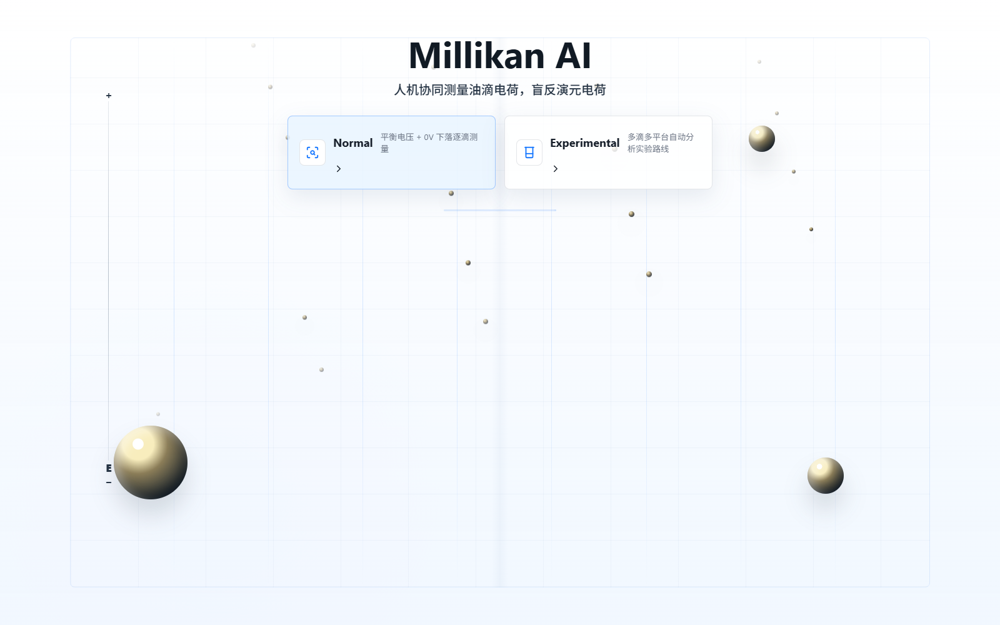
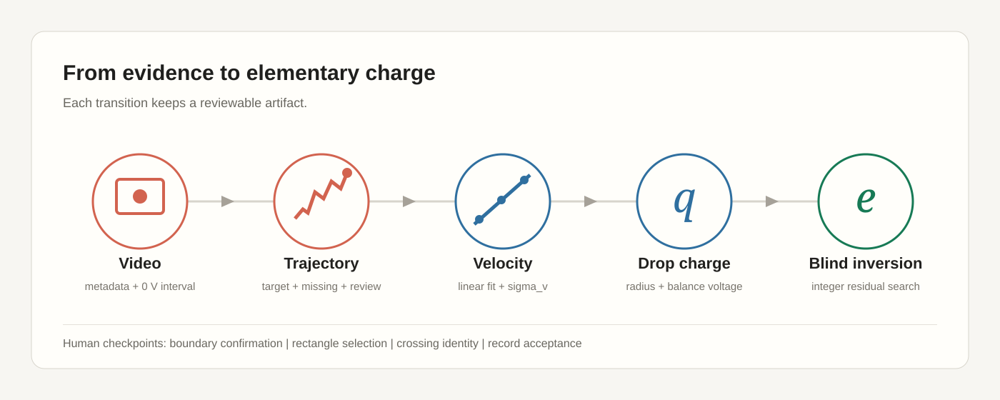
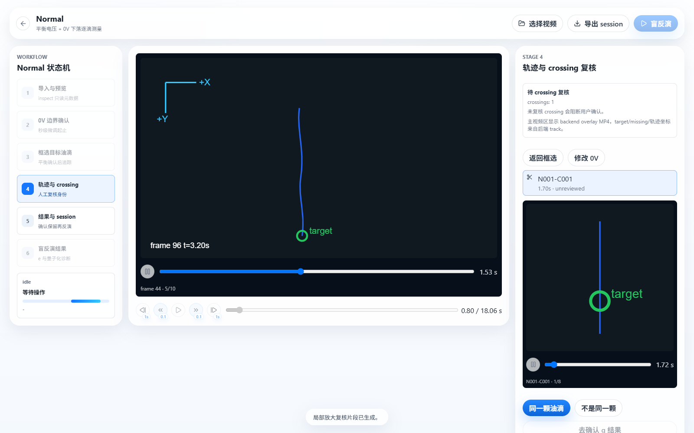
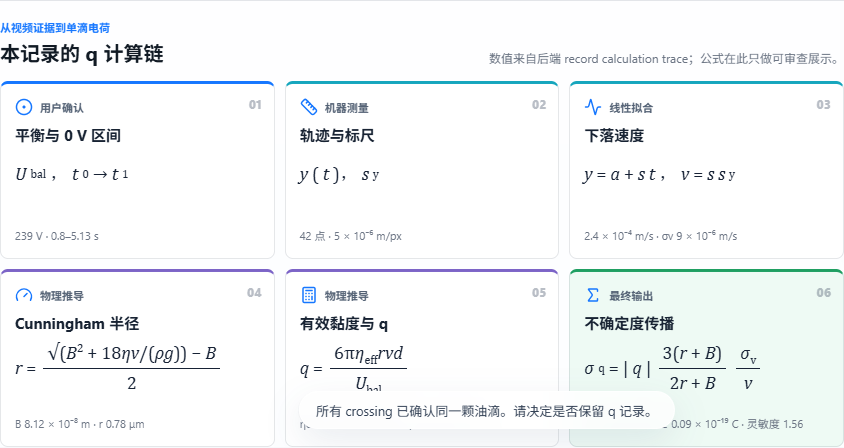
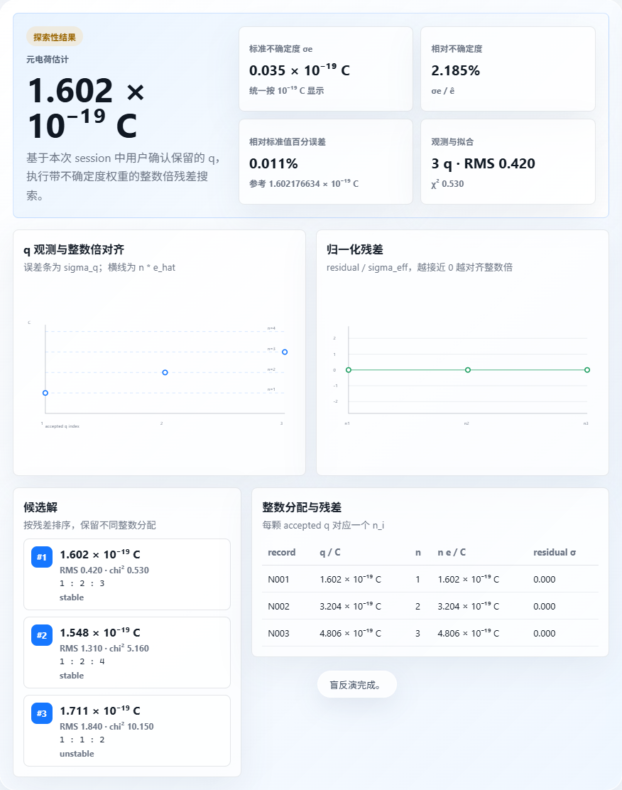
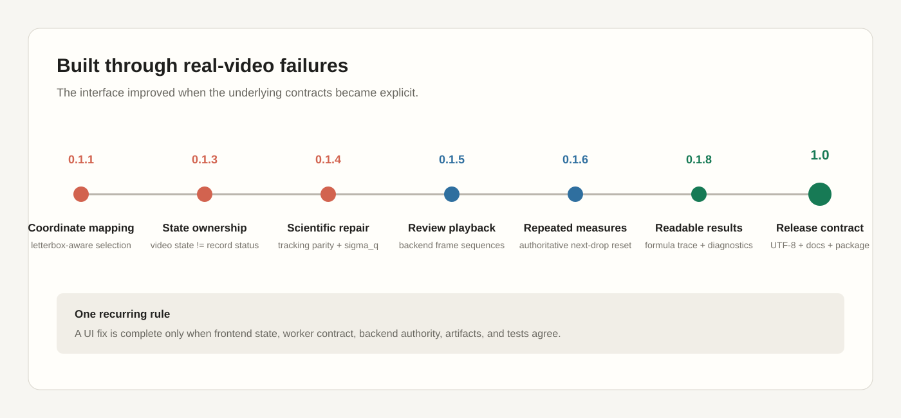

# Millikan AI

**A human-in-the-loop desktop instrument for the Millikan oil-drop experiment.**

**Presented by X**

[](https://github.com/teddyli18000/AiForMillikan/releases/latest)
[](https://github.com/teddyli18000/AiForMillikan/releases/latest)
[](apps/desktop)
[](src/millikan_ai)

Millikan AI turns a physics-course video experiment into an inspectable
measurement workflow. The software suggests where to look, tracks one selected
droplet, asks the experimenter to review ambiguous crossings, calculates a
single-drop charge with an explicit uncertainty trace, and performs a blind
integer-residual search after at least three accepted measurements.

It is designed as an assistant, not an automatic authority. User confirmation
remains part of the scientific record.



## Get the app

- **Download:** [Millikan AI 1.0 for Windows](https://github.com/teddyli18000/AiForMillikan/releases/latest)
- **Verify:** the release includes `Millikan-AI-Portable-1.0.0.exe.sha256`
- **Test video:** [open the Releases page](https://github.com/teddyli18000/AiForMillikan/releases)
  <!-- Replace this link with the dedicated test-video Release after it is published. -->
- **Documentation:** [technical and academic documentation](docs/README.md)

The portable EXE is currently unsigned. Windows SmartScreen may therefore ask
for confirmation even when the downloaded file matches the published SHA256.

## The Normal workflow

`Normal` is the recommended product route. It follows the traditional
balance-voltage plus `0 V` falling method while keeping every consequential
choice visible.



1. Import a video by file picker or drag and drop.
2. Review the automatically suggested `0 V` interval and adjust it in seconds.
3. Confirm the balance voltage and select one droplet with a rectangle.
4. Inspect the tracked trajectory and review every grid crossing.
5. Review the fitted velocity, radius, charge, and included uncertainty source.
6. Accept or reject the record. Repeat across droplets or videos.
7. With at least three accepted charges, run the blind elementary-charge search.

### Evidence before answers

The renderer does not invent tracking coordinates. Whole-trajectory and
crossing-review frames are drawn by the Python backend in original video pixel
coordinates, then played by the desktop interface.



### A visible calculation chain

The single-drop result is not only a number. Stage 5 shows the measured inputs,
linear fit, Cunningham correction, charge equation, and uncertainty propagation
using values returned in the backend record.



### Blind inversion with diagnostics

Stage 6 reports the estimated elementary charge, standard uncertainty, reference
percentage error, candidate integer assignments, and per-record residuals. With
three records the result is explicitly marked exploratory.



## Two routes, intentionally separated

| Route | Purpose | Status |
| --- | --- | --- |
| **Normal** | One user-selected droplet at a time; human review; transient session; blind inversion | Recommended |
| **Experimental** | Automatic multi-drop and multi-platform research pipeline | Experimental |

The routes have separate frontend state, worker operations, backend modules,
sessions, outputs, and tests. Normal does not call Experimental business logic
as a shortcut.

## Building the product

This repository began as a physics-themed experiment and grew through repeated
real-video failures. The visible workflow is the result of fixing the contracts
underneath it, not only polishing screens.



### Problems that changed the design

| Problem observed in real use | What changed |
| --- | --- |
| Selection rectangles drifted away from the pointer | Video letterboxing and displayed-content offsets became part of the coordinate contract. |
| Returning to edit restored an automatic suggestion | Confirmed boundaries and record snapshots became authoritative restore points. |
| Frontend and backend advanced to different states | Video preparation state and post-tracking record status were separated and validated by worker operations. |
| Local review MP4s appeared as black video controls | Crossing review moved to backend-generated frame sequences with a renderer-owned player. |
| A second droplet reused `tracking` state | `normal.startNextDroplet` now resets the authoritative backend state before the UI returns to selection. |
| Pressure and physical defaults disagreed across layers | The backend configuration became the only default source; Normal pressure is expressed in kPa. |
| An empirical value was labelled `sigma_q` | The implementation moved to regression slope uncertainty and nonlinear `q(v)` propagation. |
| Chinese progress text occasionally became mojibake | Worker pipes, decoders, exports, source files, and tests now share an explicit UTF-8 contract. |

The detailed version-by-version record is kept in
[docs/版本修复记录.md](docs/%E7%89%88%E6%9C%AC%E4%BF%AE%E5%A4%8D%E8%AE%B0%E5%BD%95.md).

## Run from source

Prerequisites: Windows, Python 3.11+, and Node.js.

```powershell
python -m venv .venv
.venv\Scripts\python -m pip install --upgrade pip
.venv\Scripts\python -m pip install -e . pytest
cd apps\desktop
npm install
npm run dev
```

Build the portable application:

```powershell
cd apps\desktop
npm run package
```

Run the complete validation suites:

```powershell
.venv\Scripts\python -m pytest tests -q --basetemp runs\pytest_tmp_work -o cache_dir=runs\pytest_cache_work
cd apps\desktop
npm test -- --run
npm run build
```

Project dependencies belong in the local `.venv` and `apps/desktop/node_modules`;
do not install them into a global Python or base Conda environment.

## A two-person physics experiment

- [Xinchen Lee](https://github.com/teddyli18000) — product concept, workflow and
  system architecture, desktop application, scientific integration, and release
  engineering.
- [teammate](https://github.com/teddyli18000/AiForMillikan/graphs/contributors) —
  experimental data and video collection, plus the local Trackpy tracking
  prototype used to validate the main single-droplet tracking direction.

<!-- Replace the teammate contributors link with a personal profile when available. -->

## Academic method

For a user-confirmed balanced droplet, the electric force balances the effective
weight. During the confirmed `0 V` interval, a linear fit to vertical position
provides the falling speed. The Normal path applies the Cunningham correction,
solves for droplet radius, and then calculates charge from the balance voltage.

The blind inversion scans candidate elementary charges, assigns each measured
charge an integer multiplier, re-estimates the candidate with uncertainty
weights, and repeats until the assignments stabilize or the iteration limit is
reached.

The derivations and contracts are documented in:

- [Experiment method](docs/academic/experiment-method.md)
- [Single-drop charge calculation](docs/academic/charge-measurement.md)
- [Uncertainty model](docs/academic/uncertainty.md)
- [Blind inversion](docs/academic/blind-inversion.md)
- [Scientific boundaries](docs/academic/scientific-boundaries.md)

## Scientific boundaries

- The program does **not** automatically prove that a droplet was balanced; the
  experimenter confirms that condition.
- Normal 1.0 includes the random uncertainty from the velocity fit. The UI lists
  physical uncertainty sources that are not yet included.
- Three accepted charges permit an exploratory inversion, not a proof of charge
  quantization.
- Normal does not fit a continuous baseline model and therefore does not claim a
  quantized-model victory.
- Experimental quality filtering reports an untrained rule adapter, not a
  trained ML model.

Machine-readable artifacts remain available for audit and reproduction. See the
[technical documentation](docs/technical/architecture.md) for architecture,
state, tracking, encoding, packaging, and validation details.

## Release

The formal Windows build, checksum, release notes, and future sample-video
assets are published on [GitHub Releases](https://github.com/teddyli18000/AiForMillikan/releases).
