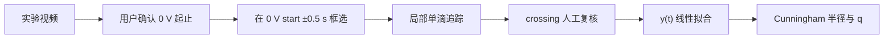

# 实验方法：平衡电压与 0 V 下落

## 测量思想

Millikan AI 1.0 Normal 使用传统的“平衡 + 自由下落”special case。它不尝试从视频中自动判断油滴是否真的平衡，而是要求用户确认：

1. 某颗油滴在输入的平衡电压 \(U\) 下近似静止；
2. 随后电压切换到 \(0\ \mathrm{V}\)；
3. 软件在用户确认的 0 V 区间内拟合这颗油滴的下落速度。

坐标约定为视频 \(+Y\) 向下，因此有效下落速度应为正。

## 力学关系

平衡时，电场力抵消油滴的有效重力：

\[
qE = \frac{4}{3}\pi r^3 \rho g,
\qquad E=\frac{U}{d}.
\]

其中 \(q\) 为油滴电荷绝对值，\(r\) 为半径，\(\rho\) 为油密度，\(g\) 为重力加速度，\(d\) 为极板距离。

在 \(0\ \mathrm{V}\) 下落并达到终端速度时，使用带 Cunningham 修正的 Stokes 模型估计半径。Normal 只使用用户框选的一颗油滴，不把自动候选选择当作实验结论。

## 视频到测量

自动边界只是建议。最终计算使用用户确认的秒数；选择帧必须与矩形框所在画面一致。

## 默认物理参数

Normal backend 当前默认值为：

| 量 | 默认值 |
|---|---:|
| 极板距离 \(d\) | \(0.005\ \mathrm{m}\) |
| 标尺测量距离 | \(0.0015\ \mathrm{m}\) |
| 油密度 \(\rho\) | \(981\ \mathrm{kg\,m^{-3}}\) |
| 气压 \(p\) | \(101.325\ \mathrm{kPa}\) |
| 重力加速度 \(g\) | \(9.79\ \mathrm{m\,s^{-2}}\) |
| 空气黏度 \(\eta\) | \(1.83\times10^{-5}\ \mathrm{Pa\,s}\) |
| Cunningham 参数 \(b\) | \(8.226\times10^{-6}\ \mathrm{kPa\,m}\) |

高级参数修改只影响当前测量记录，并在 record 中保存实际使用值。
