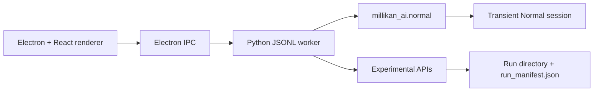

# 系统架构

## 产品边界

Millikan AI 1.0 是 Windows portable 桌面程序。当前推荐路径是 `Normal`：用户确认实验含义不明确的步骤，软件负责视频辅助、局部追踪、可视化证据、物理计算和元电荷盲反演。

`Experimental` 保留自动多滴、多平台分析路线，用于研究和诊断。两种模式不共享业务状态、worker op、session 或结果 contract。



## 运行进程

### Renderer

`apps/desktop/src/` 负责模式选择、播放器、阶段 UI、框选、复核、结果图表和导出入口。Renderer 不直接读取任意本地文件，也不重算物理结果。

### Electron main process

`apps/desktop/electron/` 负责：

- 文件与目录对话框；
- Normal 与 Experimental IPC 分发；
- 启动 Python worker；
- 把 worker progress 转发给对应请求；
- PDF/文件导出；
- 最大化窗口；
- 应用退出时清理 transient Normal session。

### Python worker

`millikan_ai.desktop_worker` 使用 UTF-8 JSON Lines 接收：

```json
{"id":"req_1","op":"normal.prepareVideo","payload":{}}
```

返回 `progress`、`result` 或 `error`。Normal ops 只调用 `millikan_ai.normal`；Experimental ops 使用原有 API、pipeline 与 downstream 路线。

## 数据源真值

- 视频 metadata、边界、网格、目标框、轨迹、crossing、fit、q 与反演结果以 Python session/record 为准。
- 前端只保留交互草稿，不得成为 authoritative scientific state。
- 轨迹坐标与叠加图由后端在原视频像素坐标中生成，前端不推断或重画。
- 用户输入的高级物理参数是单条记录的 sparse override；默认值只来自 Normal backend config。

## 存储

Normal session 每次启动重新创建，可在一次启动中跨多个视频累积 accepted q。退出应用会清理未导出的 transient session。用户主动导出时生成报告、q 表、反演 JSON 和复核证据。

Experimental 每次分析生成独立 run directory，并以 `run_manifest.json` 作为前端入口。
