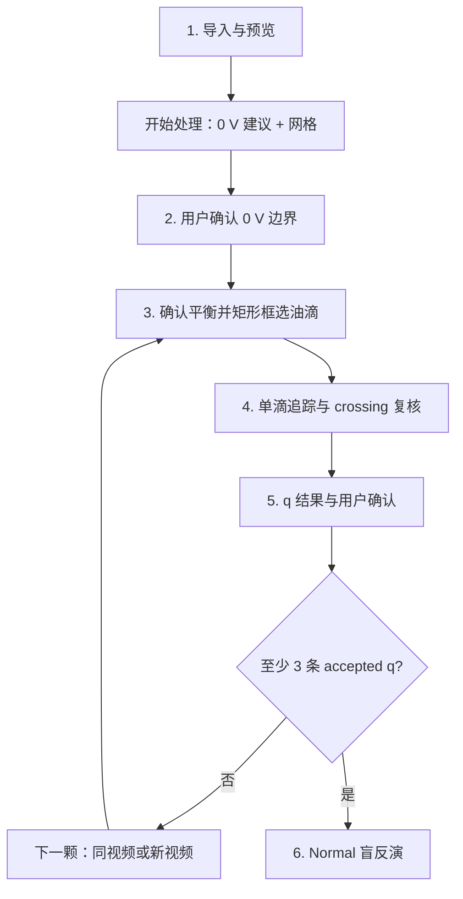

# Normal 工作流与状态机

## 用户流程



## Worker 职责

- `normal.initialize`：创建本次启动的 transient session，返回 backend defaults。
- `normal.inspectVideo`：纯读取 metadata 与 playable URL，不创建 session。
- `normal.prepareVideo`：用户点击开始后执行边界建议和网格检测。
- `normal.confirmBoundary`：保存用户最终秒数并重算帧号与 selection window。
- `normal.selectTarget`：验证平衡确认、电压、框选和实际选择帧。
- `normal.saveMeasurement`：追踪、生成证据、拟合速度并计算 q。
- `normal.prepareCrossingReview`：点击 crossing 后按需生成局部 review frames。
- `normal.reviewCrossing`：只接受 `same_drop` 或 `different_drop`。
- `normal.updateRecordSelection`：用户明确接受或排除记录。
- `normal.startNextDroplet`：在 backend 重置同视频或新视频状态。
- `normal.runInversion`：只使用符合条件的 accepted Normal records。

## 两套状态

`active_video.state` 只描述视频和追踪准备：

```text
video_prepared
→ boundary_confirmed
→ target_selected
→ tracking
```

`record.status` 只描述追踪后的结果：

```text
pending_crossing_review
→ pending_user_confirmation
→ accepted
```

异常记录使用：

```text
diagnostic
rejected_crossing_identity
rejected_by_user
```

禁止把 record status 写回 `active_video.state`。每个 worker op 都在后端检查前置状态。

## 返回修改

- 返回边界时恢复该记录的用户确认快照，不恢复自动建议值。
- 修改边界会使当前 target、tracking、review 和 q draft 失效。
- 修改 selection time 或矩形框会使 tracking、review 和 q draft 失效。
- 已生成 record 保持不可变，用 retry link 连接重新追踪的新记录。
- selection time 必须位于用户确认 `0V_start_s ± 0.5 s`，并裁剪到视频范围。

## 下一颗油滴

- `same_video`：保留视频、metadata、grid 和 confirmed boundary，backend 将状态恢复到 `boundary_confirmed`。
- `different_video`：清空 active video，保留本次 session 已 accepted q。

前端不能只切换页面；必须等待 worker 确认状态更新。
