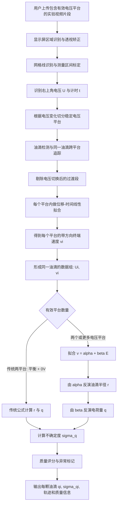

# 密立根油滴 AI+ 项目底层算法说明：从实验视频到单颗油滴电荷量 $q_i$

> 本文档只讨论“如何从实验视频计算每一颗油滴的电荷量 $q_i$ 及其不确定度 $\sigma_{q_i}$”。  
> 暂不涉及后续的基本电荷 $e$ 盲反演、整数倍聚类和量子化统计验证。

---

## 1. 总体目标

本系统面向密立根油滴实验的视频数据。用户上传包含仪器显示屏的实验视频后，系统自动识别电压、网格线、油滴轨迹和稳定运动片段，并在物理约束下计算每颗油滴的电荷量。

需要特别说明的是：系统并不要求视频一定包含喷油前空白画面或完整实验全过程。空白画面可以用于辅助背景建模，但不是必要条件。只要视频中同一颗油滴在至少两个不同电压平台下各自具有足够长的稳定运动片段，系统就可以完成电荷量反演。

本算法采用统一框架：

**多电压平台稳态速度拟合法**  
**Multi-voltage terminal-velocity fitting method**

它能够兼容两类实验操作：

1. **传统流程**：调节电压使某颗油滴静止，然后按下 $0\,\mathrm{V}$，测量其匀速下落时间。
2. **扩展流程**：用户在实验过程中调节两个或三个不同电压，只要同一颗油滴在每个电压下都出现稳定速度片段，就可以通过 $v-E$ 线性拟合反演半径和电荷量。

因此，传统的“平衡电压 + 断电下落”不是被废弃，而是该统一框架在两个电压平台下的特殊情况。

---

## 2. 用户输入、系统流程、用户输出

### 2.1 用户输入

用户需要输入或确认三类信息。

| 类别 | 内容 | 说明 |
|---|---|---|
| 实验视频 | 拍摄仪器显示屏的完整视频 | 视频应包含喷油前空白画面、喷油过程、调压过程、油滴稳定运动过程，以及右上角电压/计时显示 |
| 仪器参数 | 极板间距 $d$、测量距离 $l$、油滴密度 $\rho$、空气粘滞系数 $\eta$、气压 $p$、Cunningham 修正常数等 | 默认值按照 PPT 中给出的仪器与常数设置；用户可在合理范围内调整 |
| 计算设置 | 电压方向约定、速度方向约定、稳定段长度阈值、质量筛选阈值 | 默认采用“竖直向下为正方向” |

其中，按照当前 PPT 和实验画面约定：

- 右上角第一行显示当前电压 $U$；
- 右上角第二行显示计时 $t$；
- 屏幕为黑底白线网格；
- **第二根白线到倒数第二根白线之间为有效测量全程**；
- 默认测量距离：$l=1.5\,\mathrm{mm}$；
- 默认极板间距：$d=5\,\mathrm{mm}$；
- 其他物理常数默认采用 PPT 中给出的数值，并允许用户在参数设置中修改。


最低可用视频条件可以概括为：

```text
同一颗油滴
+ 至少两个不同电压平台
+ 每个平台持续时间大于阈值 x
+ 每个平台内有可拟合的稳定运动轨迹
+ 电压读数可识别或由用户补充
```

其中，喷油前空白画面、完整喷油过程和完整调压过程都属于增强信息：有则可以提高检测稳定性，没有也不应阻断计算。

---

### 2.2 完整计算流程图



---

### 2.3 用户输出

系统对每颗有效油滴输出一条结构化记录。

| 输出项 | 含义 |
|---|---|
| `drop_id` | 油滴编号 |
| `video_segment` | 油滴对应的视频时间段 |
| `trajectory` | 油滴轨迹 $x(t),y(t)$ |
| `platforms` | 识别出的电压平台 $[(U_1,v_1),(U_2,v_2),\dots]$ |
| `r` | 油滴半径估计值 |
| `q` | 油滴电荷量估计值 |
| `sigma_q` | 电荷量不确定度 |
| `quality_score` | 轨迹与物理拟合质量评分 |
| `flags` | 异常标记，例如轨迹过短、速度不稳、电荷突变疑似、遮挡、重叠等 |

对用户展示时可以给出：

```text
第 12 颗油滴：
平衡/拟合电压平台：U1 = ..., U2 = ..., U3 = ...
终端速度：v1 = ..., v2 = ..., v3 = ...
半径：r = ...
电荷量：q = ...
不确定度：σq = ...
质量评分：...
```

---

## 3. 视频数据到物理数据的转换

### 3.1 显示屏区域识别与矫正

用户拍摄的是仪器显示屏，而不是理想的计算机画面。因此视频中可能存在：

- 手机倾斜导致的透视变形；
- 显示屏边框；
- 反光和曝光变化；
- 网格线倾斜；
- 文字区域与油滴区域混杂。

系统首先识别显示屏区域，并将其变换到标准矩形坐标系。矫正后的坐标系用于后续网格识别、油滴定位和速度计算。

该步骤的输出是：

$$
I_t(x,y)
$$

其中 $I_t$ 表示第 $t$ 帧的标准化显示屏图像。

如果视频中包含喷油前空白画面，系统可以额外建立背景模型，用于削弱网格线、固定噪声和屏幕反光对油滴检测的影响。但该步骤是可选增强项，不是算法的必要输入。若没有空白画面，系统仍可通过网格线掩膜、亮点检测、时间连续性约束和轨迹拟合来识别油滴。

---

### 3.2 网格线识别与物理尺度标定

在矫正后的显示屏图像中，系统识别横向网格线。

按照实验约定：

$$
 y_{\mathrm{start}} = \text{第二根白线}
$$

$$
 y_{\mathrm{end}} = \text{倒数第二根白线}
$$

两者之间对应物理测量距离：

$$
 l = 1.5\,\mathrm{mm}
$$

若两根线在像素坐标中的距离为：

$$
\Delta y_{\mathrm{px}} = |y_{\mathrm{end}} - y_{\mathrm{start}}|
$$

则纵向像素-物理尺度为：

$$
 s_y = \frac{l}{\Delta y_{\mathrm{px}}}
$$

其中 $s_y$ 的单位为 $\mathrm{mm/px}$ 或 $\mathrm{m/px}$。

之后任意油滴在竖直方向的像素位移 $\Delta y_{\mathrm{px}}$ 都可以换算为真实位移：

$$
\Delta y = s_y \Delta y_{\mathrm{px}}
$$

---

### 3.3 电压平台自动识别

系统从右上角电压显示区域提取当前电压 $U(t)$。当 $U(t)$ 在一段时间内保持近似恒定，并且该持续时间超过阈值 $x$ 时，该时间段被识别为一个候选稳定电压平台：

$$
\mathcal{P}_i = [t_i^{\mathrm{start}}, t_i^{\mathrm{end}}, U_i]
$$

其中 $x$ 暂不在本文档中固定。它后续应由视频帧率、油滴速度范围、单个平台内可用位移长度、线性拟合所需最少帧数共同决定。

平台可以是非零电压，也可以是 $0\,\mathrm{V}$。系统不把 $0\,\mathrm{V}$ 排除，而是将其视为有效测量状态：

$$
U_i = 0 \quad \Rightarrow \quad E_i = 0
$$

电场强度由极板间距给出：

$$
E_i = \frac{U_i}{d}
$$

其中默认：

$$
d = 5\,\mathrm{mm}
$$

如果需要处理电场方向，系统应使用带符号电压 $U_i$。若仪器只显示电压大小，则需要在参数设置中规定当前接线方向对应的电场方向。

---

### 3.4 油滴轨迹提取与跨平台匹配

对于每颗油滴，系统在视频中得到轨迹：

$$
(x_k,y_k,t_k), \quad k=1,2,\dots,N
$$

在多电压平台算法中，关键不是单独识别某一帧的油滴，而是保证多个平台中的轨迹属于**同一颗油滴**。

因此轨迹匹配需要满足：

1. 空间位置连续；
2. 速度变化符合电压切换后的物理趋势；
3. 油滴大小、亮度、形态在短时间内相对稳定；
4. 没有与其他油滴发生明显遮挡或混叠。

如果同一颗油滴在某次电压切换后丢失，或者与其他油滴混淆，则该油滴应被标记为低质量数据，而不是强行计算。

---

## 4. 稳态速度提取

### 4.1 为什么要剔除过渡段

电压改变后，油滴不会瞬间达到新的终端速度，而是会经历短暂加速过程。密立根计算所需的是终端速度，而不是刚切换电压后的瞬时速度。

因此，对每个电压平台 $\mathcal{P}_i$，系统需要剔除平台开始后的短暂过渡段：

$$
[t_i^{\mathrm{start}}, t_i^{\mathrm{start}}+\Delta t_{\mathrm{transient}}]
$$

保留稳定段：

$$
[t_i^{\mathrm{stable\_start}}, t_i^{\mathrm{end}}]
$$

其中 $\Delta t_{\mathrm{transient}}$ 可以由经验阈值设定，也可以根据速度是否稳定自动判断。剔除过渡段后，剩余稳定段仍需满足最短持续时间要求：

$$
t_i^{\mathrm{end}}-t_i^{\mathrm{stable\_start}} \ge x
$$

否则该平台不参与该油滴的 $v-E$ 拟合。

---

### 4.2 终端速度线性拟合

在某一稳定电压平台内，若油滴已经达到终端速度，则竖直位移与时间近似满足线性关系：

$$
y(t) = a_i + v_i t + \epsilon_t
$$

其中：

- $v_i$ 是该电压平台下的带方向终端速度；
- $\epsilon_t$ 是定位误差和布朗运动等扰动。

系统通过最小二乘拟合得到 $v_i$。

若设竖直向下为正方向：

- 油滴向下运动：$v_i > 0$；
- 油滴向上运动：$v_i < 0$；
- 油滴近似静止：$v_i \approx 0$。

这是后续 $v-E$ 拟合能够成立的关键。

---

### 4.3 传统下落时间与视频穿线时间的关系

在传统流程中，人工读数往往记录油滴通过固定距离 $l$ 所需的时间 $t_g$：

$$
v_0 = \frac{l}{t_g}
$$

在视频算法中，更稳妥的做法是自动识别油滴穿过第二根白线和倒数第二根白线的时刻：

$$
t_g = t(y=y_{\mathrm{end}}) - t(y=y_{\mathrm{start}})
$$

如果右上角计时正好从第二根线开始、到倒数第二根线结束，则显示计时可以直接作为 $t_g$。如果人工按键时刻与穿线时刻不完全一致，则应优先使用视频穿线时间，并将右上角计时作为校验。

---

## 5. 物理模型与公式推导

### 5.1 基本受力模型

按照 PPT 中的物理模型，油滴主要受三个力：

1. 重力；
2. 电场力；
3. 空气粘滞阻力。

规定竖直向下为正方向，油滴终端速度为 $v$，电场强度为 $E$。

油滴半径为 $r$，有效密度记为 $\rho$。若忽略空气浮力，$\rho$ 可直接取油滴密度；若需要更严格处理，可将 $\rho$ 理解为油滴密度与空气密度之差。为与 PPT 公式保持一致，系统默认使用 PPT 中给出的密度参数。

油滴有效重力为：

$$
G = \frac{4}{3}\pi r^3 \rho g
$$

电场力为：

$$
F_E = qE
$$

Stokes 粘滞阻力大小为：

$$
F_f = 6\pi \eta_{\mathrm{eff}} r v
$$

其中 $\eta_{\mathrm{eff}}$ 是经过 Cunningham 修正后的等效粘滞系数。

在终端速度状态下，油滴加速度近似为零：

$$
G + qE - 6\pi\eta_{\mathrm{eff}}rv = 0
$$

整理得到：

$$
v = \frac{G}{6\pi\eta_{\mathrm{eff}}r} + \frac{q}{6\pi\eta_{\mathrm{eff}}r}E
$$

将其写成线性形式：

$$
v = \alpha + \beta E
$$

其中：

$$
\alpha = \frac{G}{6\pi\eta_{\mathrm{eff}}r}
$$

$$
\beta = \frac{q}{6\pi\eta_{\mathrm{eff}}r}
$$

进一步代入 $G$：

$$
\alpha = \frac{2\rho g r^2}{9\eta_{\mathrm{eff}}}
$$

因此：

- $\alpha$ 对应 $0\,\mathrm{V}$ 时油滴自然下落的终端速度；
- $\beta$ 对应速度随电场变化的斜率，包含电荷量信息。

---

## 6. 多电压平台稳态速度拟合法

### 6.1 输入数据结构

对于同一颗油滴，系统最终得到一组平台数据：

$$
(U_1,v_1),(U_2,v_2),\dots,(U_m,v_m)
$$

换算为电场强度：

$$
E_i = \frac{U_i}{d}
$$

得到：

$$
(E_1,v_1),(E_2,v_2),\dots,(E_m,v_m)
$$

其中 $m\ge 2$ 时可以计算电荷量；$m\ge 3$ 时可以进一步通过残差判断数据质量。

---

### 6.2 线性拟合

对数据点拟合：

$$
v_i = \alpha + \beta E_i + \epsilon_i
$$

若每个平台速度拟合得到的不确定度为 $\sigma_{v_i}$，可以使用加权最小二乘：

$$
\min_{\alpha,\beta}\sum_{i=1}^m \frac{(v_i-\alpha-\beta E_i)^2}{\sigma_{v_i}^2}
$$

得到：

$$
\hat{\alpha},\hat{\beta}
$$

若只有两个平台，直线由两点唯一确定：

$$
\hat{\beta}=\frac{v_2-v_1}{E_2-E_1}
$$

$$
\hat{\alpha}=v_1-\hat{\beta}E_1
$$

若平台数量不少于三个，则拟合残差：

$$
R_i = v_i - \hat{\alpha} - \hat{\beta}E_i
$$

可用于判断：

- 速度是否真正达到稳态；
- 油滴是否在平台间发生电荷突变；
- 是否存在轨迹混淆；
- 电压识别是否错误。

---

### 6.3 由 $\alpha$ 反演油滴半径

由：

$$
\alpha = \frac{2\rho g r^2}{9\eta_{\mathrm{eff}}}
$$

得到：

$$
r = \sqrt{\frac{9\eta_{\mathrm{eff}}\alpha}{2\rho g}}
$$

如果暂不考虑 Cunningham 修正，则 $\eta_{\mathrm{eff}}=\eta$，可直接计算：

$$
r_0 = \sqrt{\frac{9\eta\alpha}{2\rho g}}
$$

但实际油滴很小，空气不能完全视为连续介质，因此必须进行 Cunningham 修正。

---

### 6.4 Cunningham 修正

PPT 中指出，Stokes 定律默认空气是连续流体；但油滴尺度较小时会出现滑动效应，使实际粘滞阻力小于经典 Stokes 阻力。因此需要进行 Cunningham 修正。

采用等效粘滞系数写法：

$$
\eta_{\mathrm{eff}}(r)=\frac{\eta}{1+\frac{b}{pr}}
$$

其中：

- $\eta$：空气粘滞系数；
- $p$：气压；
- $b$：Cunningham 修正常数；
- $r$：油滴半径。

由于 $\eta_{\mathrm{eff}}$ 本身依赖 $r$，半径不能一次直接算出，需要迭代求解。

推荐迭代过程：

1. 忽略修正，计算初值：

$$
r^{(0)} = \sqrt{\frac{9\eta\hat{\alpha}}{2\rho g}}
$$

2. 用当前半径更新修正粘滞系数：

$$
\eta_{\mathrm{eff}}^{(k)}=\frac{\eta}{1+\frac{b}{p r^{(k)}}}
$$

3. 更新半径：

$$
r^{(k+1)}=\sqrt{\frac{9\eta_{\mathrm{eff}}^{(k)}\hat{\alpha}}{2\rho g}}
$$

4. 当满足：

$$
\left|r^{(k+1)}-r^{(k)}\right| < \varepsilon_r
$$

时停止迭代。

最终得到：

$$
\hat{r}=r^{(k+1)}
$$

---

### 6.5 由 $\beta$ 反演电荷量

由：

$$
\beta = \frac{q}{6\pi\eta_{\mathrm{eff}}r}
$$

得到：

$$
q = 6\pi\eta_{\mathrm{eff}}r\beta
$$

代入拟合结果：

$$
\hat{q}=6\pi\eta_{\mathrm{eff}}(\hat{r})\hat{r}\hat{\beta}
$$

如果实际拟合的是电压而不是电场：

$$
v = \alpha + \gamma U
$$

由于：

$$
E=\frac{U}{d}
$$

所以：

$$
\gamma = \frac{\beta}{d}
$$

即：

$$
\beta = \gamma d
$$

此时电荷量为：

$$
\hat{q}=6\pi\eta_{\mathrm{eff}}(\hat{r})\hat{r}d\hat{\gamma}
$$

若只关心电荷量大小，可以输出：

$$
|\hat{q}|
$$

若需要研究电荷符号，则必须保留电场方向和速度方向的符号约定。

---

## 7. 传统“平衡电压 + 断电下落”作为特殊情况

### 7.1 传统数据形式

传统实验中，同一颗油滴有两个状态：

1. 平衡状态：

$$
U = U_{\mathrm{bal}}, \quad v \approx 0
$$

2. 断电下落状态：

$$
U=0, \quad v=v_0
$$

其中：

$$
v_0 = \frac{l}{t_g}
$$

这等价于多电压平台拟合中的两个点：

$$
\left(\frac{U_{\mathrm{bal}}}{d},0\right),\quad (0,v_0)
$$

因此，传统实验是统一模型的 two-point special case。

---

### 7.2 传统公式推导

断电下落时：

$$
E=0
$$

终端速度满足：

$$
G = 6\pi\eta_{\mathrm{eff}}rv_0
$$

即：

$$
\frac{4}{3}\pi r^3\rho g = 6\pi\eta_{\mathrm{eff}}rv_0
$$

整理得：

$$
r = \sqrt{\frac{9\eta_{\mathrm{eff}}v_0}{2\rho g}}
$$

平衡状态下：

$$
v=0
$$

重力与电场力平衡：

$$
G + qE_{\mathrm{bal}} = 0
$$

取电荷量大小：

$$
|q| = \frac{G}{|E_{\mathrm{bal}}|}
$$

又：

$$
E_{\mathrm{bal}}=\frac{U_{\mathrm{bal}}}{d}
$$

所以：

$$
|q| = \frac{4\pi r^3\rho g d}{3|U_{\mathrm{bal}}|}
$$

也可以利用 $G=6\pi\eta_{\mathrm{eff}}rv_0$ 写成：

$$
|q| = \frac{6\pi\eta_{\mathrm{eff}}rv_0d}{|U_{\mathrm{bal}}|}
$$

这与多电压平台模型中：

$$
q = 6\pi\eta_{\mathrm{eff}}r\beta
$$

完全一致。

---

## 8. 不确定度估计

### 8.1 不确定度来源

单颗油滴电荷量的不确定度主要来自：

| 来源 | 影响对象 |
|---|---|
| 电压识别误差 | $U_i$、$E_i$、$\beta$ |
| 油滴定位误差 | $y(t)$、$v_i$ |
| 帧率误差或计时误差 | $t$、$v_i$ |
| 网格线识别误差 | $l$、像素尺度 $s_y$ |
| 极板间距误差 | $d$、$E_i$ |
| 空气粘滞系数误差 | $\eta$、$r$、$q$ |
| 气压误差 | Cunningham 修正 |
| 油滴密度误差 | $r$、$q$ |
| 布朗运动 | 轨迹扰动、速度拟合残差 |
| 油滴蒸发/凝结 | 半径变化，模型失配 |
| 仪器不水平 | 横向漂移、竖直速度偏差 |

PPT 中已经将不可避免的布朗运动、油滴蒸发或凝结、计时反应误差、仪器不水平列为主要误差来源；系统质量评分应直接围绕这些来源设计。

---

### 8.2 速度不确定度

在每个平台内进行线性拟合：

$$
y(t)=a_i+v_it+\epsilon_t
$$

拟合可以给出 $v_i$ 的标准误差：

$$
\sigma_{v_i}
$$

若使用传统穿线法：

$$
v_0 = \frac{l}{t_g}
$$

则相对不确定度为：

$$
\left(\frac{\sigma_{v_0}}{v_0}\right)^2
=
\left(\frac{\sigma_l}{l}\right)^2
+
\left(\frac{\sigma_t}{t_g}\right)^2
$$

---

### 8.3 拟合参数不确定度

对多电压平台拟合：

$$
v_i = \alpha + \beta E_i + \epsilon_i
$$

加权最小二乘会输出参数协方差矩阵：

$$
\mathrm{Cov}(\hat{\alpha},\hat{\beta})
=
\begin{bmatrix}
\sigma_{\alpha}^2 & \sigma_{\alpha\beta} \\
\sigma_{\alpha\beta} & \sigma_{\beta}^2
\end{bmatrix}
$$

其中 $\sigma_{\alpha}$ 和 $\sigma_{\beta}$ 分别传递到 $r$ 和 $q$。

---

### 8.4 半径不确定度

若暂时忽略 Cunningham 修正中 $r$ 的隐式影响，由：

$$
r = \sqrt{\frac{9\eta\alpha}{2\rho g}}
$$

可得近似相对不确定度：

$$
\left(\frac{\sigma_r}{r}\right)^2
\approx
\frac{1}{4}
\left[
\left(\frac{\sigma_\eta}{\eta}\right)^2+
\left(\frac{\sigma_\alpha}{\alpha}\right)^2+
\left(\frac{\sigma_\rho}{\rho}\right)^2
\right]
$$

若考虑 Cunningham 修正，推荐使用数值误差传播或 Monte Carlo：

1. 从 $\alpha,\beta,\eta,\rho,p,b,d$ 的不确定度分布中随机采样；
2. 每次采样后重新迭代计算 $r$ 和 $q$；
3. 用多次结果的标准差作为 $\sigma_r$ 和 $\sigma_q$。

这样比手推复杂偏导更稳，也更适合软件实现。

---

### 8.5 电荷量不确定度

由：

$$
q=6\pi\eta_{\mathrm{eff}}r\beta
$$

近似相对不确定度为：

$$
\left(\frac{\sigma_q}{q}\right)^2
\approx
\left(\frac{\sigma_{\eta_{\mathrm{eff}}}}{\eta_{\mathrm{eff}}}\right)^2
+
\left(\frac{\sigma_r}{r}\right)^2
+
\left(\frac{\sigma_\beta}{\beta}\right)^2
$$

如果使用电压拟合斜率 $\gamma$：

$$
q=6\pi\eta_{\mathrm{eff}}rd\gamma
$$

则还需要加入极板间距不确定度：

$$
\left(\frac{\sigma_q}{q}\right)^2
\approx
\left(\frac{\sigma_{\eta_{\mathrm{eff}}}}{\eta_{\mathrm{eff}}}\right)^2
+
\left(\frac{\sigma_r}{r}\right)^2
+
\left(\frac{\sigma_d}{d}\right)^2
+
\left(\frac{\sigma_\gamma}{\gamma}\right)^2
$$

最终输出：

$$
q_i \pm \sigma_{q_i}
$$

---

## 9. 质量评分与异常检测

### 9.1 质量评分目标

质量评分的目的不是替代物理计算，而是判断某颗油滴的 $q_i$ 是否可信。

每颗油滴的质量评分可以由以下指标组成。

| 指标 | 判断意义 |
|---|---|
| 平台数量 | 至少两个不同电压平台；三个及以上更可靠 |
| 平台持续时间 | 剔除过渡段后，稳定段长度应大于阈值 $x$；太短的平台无法稳定拟合终端速度 |
| 位移-时间线性度 | $R^2$ 越高，说明越接近匀速 |
| 速度波动 | 波动过大可能受布朗运动或识别噪声影响 |
| 横向漂移 | 横向漂移过大说明仪器不水平或轨迹不理想 |
| 电压切换后残差 | 过渡段未剔除会导致速度偏差 |
| $v-E$ 拟合残差 | 过大可能说明电荷突变或轨迹匹配错误 |
| 油滴重叠/遮挡 | 会导致定位错误 |
| 亮度稳定性 | 亮度剧变可能说明识别不稳定 |

---

### 9.2 物理一致性检查

同一颗油滴在多个平台中的数据应近似满足一条直线：

$$
v_i \approx \alpha + \beta E_i
$$

如果 $m\ge 3$，可以计算归一化残差：

$$
\chi^2 = \sum_{i=1}^{m}\frac{(v_i-\hat{\alpha}-\hat{\beta}E_i)^2}{\sigma_{v_i}^2}
$$

若 $\chi^2$ 明显过大，则可能存在：

1. 该油滴没有达到终端速度；
2. 电压读数识别错误；
3. 同一轨迹中混入了其他油滴；
4. 油滴在实验过程中获得或失去电子；
5. 油滴半径发生明显变化。

这种数据不应直接删除，而应标记为低质量或异常，供用户复核。

---

## 10. 算法伪代码

```python
for video in uploaded_videos:
    screen = rectify_display_screen(video)
    grid = detect_grid_lines(screen)
    y_start, y_end = grid.second_line, grid.penultimate_line
    scale_y = l_default / abs(y_end - y_start)

    voltage_series = read_voltage_display(screen)
    platforms = segment_voltage_platforms(voltage_series)

    tracks = track_oil_drops(screen)

    for track in tracks:
        platform_measurements = []

        for platform in platforms:
            segment = extract_track_segment(track, platform)
            stable_segment = remove_transient(segment)

            if duration(stable_segment) >= x and is_long_enough(stable_segment):
                v, sigma_v, fit_quality = fit_terminal_velocity(
                    stable_segment,
                    scale_y=scale_y
                )
                platform_measurements.append({
                    "U": platform.voltage,
                    "E": platform.voltage / d_default,
                    "v": v,
                    "sigma_v": sigma_v,
                    "fit_quality": fit_quality,
                })

        if count_distinct_voltage_platforms(platform_measurements) >= 2:
            alpha, beta, cov = fit_v_E_line(platform_measurements)
            r = solve_radius_with_cunningham(alpha, constants)
            q = 6 * pi * eta_eff(r) * r * beta
            sigma_q = propagate_uncertainty(platform_measurements, constants, cov)
            quality = score_drop(track, platform_measurements, alpha, beta, q)

            save_result(drop_id, r, q, sigma_q, quality, platform_measurements)
```

---

## 11. 最终数据接口建议

单颗油滴计算完成后，建议保存为如下结构。

```json
{
  "drop_id": "drop_012",
  "valid": true,
  "method": "multi_voltage_terminal_velocity_fitting",
  "constants": {
    "l_m": 0.0015,
    "d_m": 0.005,
    "rho": "PPT_default_or_user_value",
    "eta": "PPT_default_or_user_value",
    "pressure": "PPT_default_or_user_value",
    "cunningham_b": "PPT_default_or_user_value"
  },
  "platforms": [
    {
      "U_V": 170.4,
      "E_V_per_m": 34080,
      "v_m_per_s": 0.0,
      "sigma_v": "...",
      "start_time_s": "...",
      "end_time_s": "...",
      "quality": "..."
    },
    {
      "U_V": 0.0,
      "E_V_per_m": 0.0,
      "v_m_per_s": "...",
      "sigma_v": "...",
      "start_time_s": "...",
      "end_time_s": "...",
      "quality": "..."
    }
  ],
  "fit": {
    "alpha": "...",
    "beta": "...",
    "covariance": "...",
    "residuals": ["..."]
  },
  "result": {
    "radius_m": "...",
    "charge_C": "...",
    "charge_abs_C": "...",
    "sigma_charge_C": "..."
  },
  "quality_score": "...",
  "flags": []
}
```

---

## 12. 本阶段边界

本阶段只输出每颗油滴的：

$$
q_i \pm \sigma_{q_i}
$$

以及其对应的轨迹、速度、电压平台和质量评分。

后续如果要进行基本电荷盲反演，再使用所有高质量油滴形成数据集：

$$
\{(q_i,\sigma_{q_i},w_i)\}_{i=1}^{N}
$$

其中 $w_i$ 可由质量评分转换得到。

但基本电荷 $e$ 的盲反演、整数倍 $n_i$ 的估计、量子化模型与连续模型比较，均不属于本文档范围。

---

## 13. 核心结论

本项目底层算法的关键不是单纯追踪油滴，而是把视频中的实验过程转换为物理可解释的数据：

$$
\text{视频} \rightarrow (U_i,v_i) \rightarrow (\alpha,\beta) \rightarrow (r_i,q_i,\sigma_{q_i})
$$

传统实验流程中：

$$
(U_{\mathrm{bal}}, v\approx 0),\quad (0,v_0)
$$

是该统一模型的特殊两点情况。

多电压实验流程中：

$$
(U_1,v_1),(U_2,v_2),(U_3,v_3),\dots
$$

可以通过线性拟合获得更稳健的半径与电荷量估计，并通过残差判断该油滴数据是否可信。

因此，系统最终面向用户输出的不是“视频识别结果”，而是经过物理约束校验后的：

$$
q_i \pm \sigma_{q_i}
$$

这才是后续大样本统计分析和基本电荷盲反演的基础输入。
