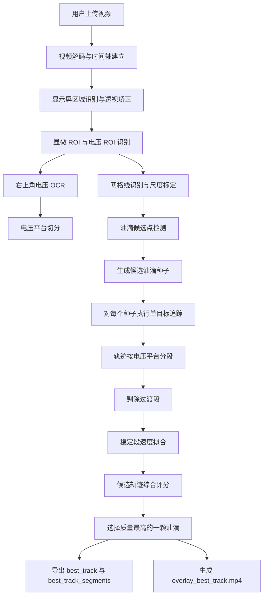

# 视频处理与最佳单颗油滴轨迹提取模块设计

> 适用阶段：项目第一版 / MVP 版本  
> 模块边界：只负责从用户上传的视频中识别电压平台、提取候选油滴轨迹，并自动选择质量最高的一颗油滴，输出其跨电压平台的稳定运动段与速度数据。  
> 不负责：单颗电荷量公式计算、元电荷盲反演、多油滴同时追踪、最终实验报告生成。

---

## 1. 当前版本目标

第一版不做全画面多油滴同时追踪，而是采用：

```text
全局候选油滴发现
→ 多个候选单目标追踪
→ 对每条候选轨迹评分
→ 自动选择质量最高的一颗油滴
→ 后续模块只处理这一颗油滴
```

这样可以显著降低实现难度，同时保留后续扩展到多油滴追踪的接口。

当前模块最终输出：

```text
best_track.csv
best_track_segments.csv
platforms.csv
diagnostics.json
overlay_best_track.mp4
```

其中最重要的是：

```text
best_track_segments.csv
```

它向后续物理计算模块提供同一颗油滴在不同电压平台下的稳定终端速度：

```text
(U_1, v_1), (U_2, v_2), ..., (U_m, v_m)
```

要求：

```text
m >= 2
```

即同一颗油滴至少在两个不同电压平台下具有可用稳定运动片段。

---

## 2. 输入视频假设

用户上传的是拍摄实验装置显示屏的完整视频，而不是单独的显微图像。

视频中通常包含：

```text
1. 黑底白线网格显微区域
2. 多个亮点油滴
3. 右上角电压显示
4. 可能存在右上角计时显示
5. 屏幕边框、反光、倾斜、塑料膜反光等干扰
```

本模块采用以下约定：

```text
1. 右上角第一行只读取电压 U(t)
2. 屏幕上的计时不作为运动时间来源
3. 油滴运动时间以视频帧时间戳为准
4. 如果无法读取真实视频时间戳，则使用 frame_idx / fps
5. 至少需要两个不同电压平台
6. 每个平台必须存在大于阈值 x 的稳定运动片段
```

---

## 3. 推荐技术栈

第一版建议采用 Python portable 桌面应用路线。

```text
UI: PySide6 / Qt
视频处理: OpenCV
粒子检测参考: trackpy
数值计算: NumPy / SciPy / pandas
OCR: Tesseract 或 EasyOCR
打包: PyInstaller one-folder portable
```

选择理由：

```text
1. OpenCV/Python 更适合本地视频处理和调试
2. trackpy 与油滴/粒子追踪场景接近，可作为参考或补充
3. PyInstaller 可以打包成用户无需安装 Python 的 portable 程序
4. 第一版需要强调可靠性，不应把复杂度放在 Web/WASM 兼容性上
```

---

## 4. 总体流程



---

## 5. 视频解码与时间轴

### 5.1 时间来源

本模块明确不使用屏幕上的计时数字作为运动时间。

优先级：

```text
1. 视频帧真实时间戳 PTS
2. frame_idx / fps
3. 用户手动指定 fps
```

输出字段：

```text
frame_idx
time_s
```

其中：

```text
time_s = frame_idx / fps
```

或使用视频解码器读取到的真实时间戳。

### 5.2 注意 variable frame rate

手机视频可能存在可变帧率。若 OpenCV 读取的 fps 与真实时间戳不一致，后续速度会产生系统误差。

推荐实现：

```text
第一版：OpenCV 读取 fps，记录警告
增强版：使用 PyAV / ffmpeg 读取真实 PTS
```

---

## 6. 显示屏区域识别与透视矫正

用户上传的视频可能存在倾斜、透视变形、屏幕边框和反光。

处理目标：

```text
把原始视频帧变换为标准正视屏幕图像
```

自动流程：

```text
1. 选取若干关键帧
2. 检测显示屏边缘或最大高对比矩形
3. 估计四个角点
4. 计算 homography
5. 对所有帧做透视矫正
```

失败回退：

```text
让用户手动点击屏幕四个角点
```

输出：

```json
{
  "screen_corners": [[x1, y1], [x2, y2], [x3, y3], [x4, y4]],
  "homography": "3x3 matrix",
  "rectified_width": 1280,
  "rectified_height": 720
}
```

---

## 7. ROI 识别

矫正后图像分为两个核心区域：

```text
microscope_roi: 油滴运动与网格区域
voltage_roi: 右上角电压显示区域
```

第一版采用：

```text
自动检测 + 用户确认
```

如果自动识别错误，用户可以手动框选。手动结果保存到项目配置中，后续同类视频复用。

---

## 8. 网格线识别与尺度标定

### 8.1 网格线检测

在 microscope_roi 中检测水平白线。

步骤：

```text
1. 灰度化
2. 提高亮线对比度
3. 使用阈值分割提取白线
4. 使用 Hough line 或水平投影检测横向网格线
5. 合并重复线
6. 按 y 坐标排序
```

### 8.2 有效测量区间

按照实验约定：

```text
第二根白线 → 倒数第二根白线
```

对应物理距离：

```text
l = 1.5 mm
```

如果用户修改仪器参数，则使用用户输入的 l。

计算：

```text
scale_y_m_per_px = l_m / abs(y_end_px - y_start_px)
```

输出：

```json
{
  "grid_lines_y": [y1, y2, y3, ...],
  "y_start_px": "第二根白线 y 坐标",
  "y_end_px": "倒数第二根白线 y 坐标",
  "measurement_distance_m": 0.0015,
  "scale_y_m_per_px": "..."
}
```

### 8.3 用户确认

必须在 UI 中显示：

```text
1. 检测出的所有横向网格线
2. 有效测量起点线
3. 有效测量终点线
4. scale_y
```

用户确认后再进入追踪。

---

## 9. 电压 OCR 与电压平台切分

### 9.1 OCR 只读电压

右上角可能同时显示电压和计时。

本模块只读取：

```text
当前电压 U(t)
```

不读取：

```text
屏幕计时 t_display
```

### 9.2 电压 OCR 流程

```text
1. 裁剪 voltage_roi
2. 放大 2~4 倍
3. 灰度化
4. 阈值化，突出蓝色/亮色点阵数字
5. 字符分割或整行 OCR
6. 只保留数字、正负号和单位 V
7. 输出 voltage_V 与 confidence
```

每帧或每隔若干帧读取一次电压。

输出：

```csv
frame_idx,time_s,voltage_V,ocr_confidence,source
0,0.000,91,0.94,ocr
30,1.000,91,0.95,ocr
...
```

如果 OCR 连续失败：

```text
1. 用相邻帧插值
2. 若整个平台失败，则让用户手动输入该平台电压
```

### 9.3 电压平台定义

电压平台是指电压在一段时间内近似恒定的区间。

平台判定条件：

```text
1. 电压中位数稳定
2. 电压波动小于 voltage_tolerance
3. 持续时间大于平台最短时间要求
4. OCR 置信度足够，或用户手动确认
```

输出：

```csv
platform_id,start_frame,end_frame,start_time_s,end_time_s,voltage_V,voltage_confidence,source
P001,0,270,0.000,9.000,91,0.94,ocr
P002,271,480,9.033,16.000,176,0.92,ocr
P003,481,570,16.033,19.000,302,0.90,ocr
```

---

## 10. 阈值 x 的定义与默认策略

之前讨论的阈值 x 不应理解为“整个平台时长必须大于 x”这么粗糙，而应定义为：

> 每个电压平台内，可用于速度拟合的稳定运动片段的最短持续时间。

记为：

```text
x_stable
```

### 10.1 为什么需要 x

每个平台内的速度拟合需要足够多的帧，否则：

```text
1. 线性拟合不稳定
2. 布朗运动影响过大
3. 油滴定位噪声被放大
4. 电压刚切换后的加速过渡段可能混入
```

### 10.2 推荐默认值

第一版默认：

```text
x_stable = max(2.0 s, 60 / fps)
```

对于 30 fps 视频：

```text
x_stable = 2.0 s
```

即每个平台至少需要约 60 帧稳定轨迹。

同时定义：

```text
x_transient = 0.5 s
```

表示电压切换后默认丢弃前 0.5 秒作为过渡段。

所以一个平台若要可用，粗略要求：

```text
platform_duration >= x_transient + x_stable
```

即默认：

```text
platform_duration >= 2.5 s
```

### 10.3 自适应修正

固定 2 秒不是绝对规则，程序应结合实际帧数和拟合质量自适应判断。

平台稳定段还需满足：

```text
num_valid_points >= 45
missing_ratio <= 0.15
speed_fit_r2 >= 0.95
speed_fit_rmse <= rmse_threshold
```

对于接近平衡的电压平台，油滴位移很小，不能强行要求大位移，但要提高位置稳定性要求：

```text
|v_y| 接近 0
position_rmse 小
持续时间 >= x_stable
```

对于明显运动的平台，除时间要求外还要求：

```text
vertical_displacement_px >= max(15 px, 0.25 * grid_spacing_px)
```

否则速度估计会不稳定。

### 10.4 x 的配置项

建议在配置文件中暴露：

```yaml
segment:
  stable_min_duration_s: 2.0
  transient_drop_s: 0.5
  min_valid_points: 45
  max_missing_ratio: 0.15
  min_fit_r2: 0.95
  min_motion_displacement_px: 15
  min_motion_displacement_grid_ratio: 0.25
```

用户界面中可以显示为：

```text
稳定运动片段最短时长 x = 2.0 s
电压切换过渡丢弃时间 = 0.5 s
```

---

## 11. 油滴候选检测

### 11.1 检测目标

在显微 ROI 中找出可能是油滴的小亮点。

每个候选点输出：

```text
frame_idx
time_s
x_px
y_px
radius_px
area_px
brightness
contrast
candidate_score
```

### 11.2 预处理

```text
1. 灰度化
2. 去噪
3. 背景估计
4. 网格线 mask
5. 局部对比度增强
```

### 11.3 网格线抑制

示例视频中，网格线比油滴更亮，是主要误检来源。

处理策略：

```text
1. 使用网格线检测结果生成 grid_mask
2. 对网格线附近区域降低候选置信度
3. 排除长条状、线状、高宽比异常区域
4. 对网格交点进行额外惩罚
```

油滴候选应满足：

```text
1. 面积较小
2. 形状近似圆形
3. 局部亮度高于背景
4. 不属于长线段
5. 在连续帧中具有时间一致性
```

---

## 12. 生成候选油滴种子

因为第一版只选择一颗最佳油滴，所以不需要完整多目标追踪。

推荐策略：

```text
1. 在每个电压平台中抽取若干关键帧
2. 对关键帧进行油滴候选检测
3. 过滤明显噪声和网格点
4. 选出若干候选种子点
5. 对每个种子执行单目标追踪
6. 最后根据轨迹质量选择最佳油滴
```

候选种子需要覆盖不同区域，避免都集中在一小块画面。

种子筛选条件：

```text
1. 不靠近边缘
2. 不贴近网格交点
3. 局部附近没有过多其他亮点
4. 在相邻帧中可被重复检测到
5. 初始亮度和圆度稳定
```

建议第一版最多追踪：

```text
top_k_seeds = 20 ~ 50
```

---

## 13. 单目标追踪算法

### 13.1 为什么选择单目标追踪

当前版本目标是找出最优一颗油滴，而不是同时追踪所有油滴。

因此每个候选种子独立执行一次 single-target tracking：

```text
seed_001 → track_candidate_001
seed_002 → track_candidate_002
...
```

最后打分选择最好的轨迹。

这样避免了完整多目标追踪中的：

```text
1. ID switch
2. 多油滴遮挡匹配
3. Hungarian 全局分配
4. 轨迹合并/分裂复杂逻辑
```

### 13.2 单目标追踪流程

每个候选油滴维护一个状态：

```text
x, y, vx, vy
```

逐帧处理：

```text
1. Kalman 预测当前帧位置
2. 在预测位置附近建立 local search window
3. 在窗口内执行 blob detection
4. 同时使用 LK 光流估计上一帧点到当前帧的位置
5. 融合 detection 与 optical flow 结果
6. 若观测可信，则更新 Kalman
7. 若观测不可信，则标记 missing
8. 连续 missing 超过阈值则结束该候选轨迹
```

融合规则：

```text
如果 detection 与 LK 结果距离很近：采用加权平均
如果 detection 可信、LK 失败：采用 detection
如果 LK 可信、detection 失败：采用 LK
如果二者冲突严重：标记为 uncertain，不强行更新
```

### 13.3 局部搜索窗口

搜索窗口大小应与速度相关：

```text
search_radius_px = base_radius + k * predicted_speed_px_per_frame
```

默认：

```text
base_radius = 20 px
k = 2.0
```

对于电压切换后的短时间，可临时增大搜索半径。

---

## 14. 轨迹按电压平台分段

一条候选轨迹得到后，按 platforms.csv 切分：

```text
candidate_track_001 / P001
candidate_track_001 / P002
candidate_track_001 / P003
```

每个平台片段先剔除过渡段：

```text
stable_start_time = platform_start_time + x_transient
```

然后取：

```text
[stable_start_time, platform_end_time]
```

如果该稳定片段持续时间小于 `x_stable`，则该平台对该轨迹不可用。

---

## 15. 稳定段速度拟合

对每个候选轨迹在每个平台内的稳定片段拟合：

```text
y(t) = v_y t + b
x(t) = v_x t + c
```

输出：

```text
v_y_px_s
v_y_m_s
sigma_v_y
v_x_px_s
r2_y
rmse_y
num_points
missing_ratio
stable
```

其中：

```text
v_y_m_s = v_y_px_s * scale_y_m_per_px
```

判断稳定的基本条件：

```text
num_points >= min_valid_points
segment_duration >= x_stable
missing_ratio <= max_missing_ratio
r2_y >= min_fit_r2
```

对于近似悬浮平台：

```text
r2_y 可能不高，因为 y 变化极小
```

此时应改用稳定性判断：

```text
abs(v_y_m_s) < balance_velocity_threshold
position_rmse_px < balance_position_rmse_threshold
segment_duration >= x_stable
```

---

## 16. 候选轨迹质量评分

每条候选轨迹计算综合质量分：

```text
score_total =
    0.25 * platform_coverage_score
  + 0.20 * tracking_continuity_score
  + 0.20 * velocity_fit_score
  + 0.15 * morphology_stability_score
  + 0.10 * grid_distance_score
  + 0.10 * voltage_confidence_score
```

### 16.1 platform_coverage_score

核心指标。

```text
至少两个不同电压平台有可用稳定段 → 才能进入候选
三个及以上平台 → 加分
```

定义：

```text
usable_platform_count < 2 → reject
usable_platform_count = 2 → 0.7
usable_platform_count >= 3 → 1.0
```

### 16.2 tracking_continuity_score

考虑：

```text
轨迹总时长
missing_ratio
valid_detection_ratio
连续 missing 最大长度
是否跨平台断裂
```

### 16.3 velocity_fit_score

考虑：

```text
各平台稳定段 R²
RMSE
速度滑动窗口稳定性
是否存在明显加速度
```

### 16.4 morphology_stability_score

考虑：

```text
radius_cv
area_cv
brightness_cv
局部对比度稳定性
```

### 16.5 grid_distance_score

油滴若长期贴近网格线或网格交点，容易误检。

```text
距离网格线越远，得分越高
```

但不能简单剔除靠近网格线的所有点，因为真实油滴也可能经过网格线。应作为惩罚，不作为硬删除。

### 16.6 voltage_confidence_score

候选轨迹覆盖的平台，其电压 OCR 置信度越高越好。

若某个平台电压由用户手动确认，也可以视为高置信度。

---

## 17. 最佳油滴选择规则

候选轨迹需要先过硬规则：

```text
1. usable_platform_count >= 2
2. 至少两个平台的稳定段时长 >= x_stable
3. track_total_duration >= 2 * x_stable
4. average_missing_ratio <= 0.15
5. 不存在严重遮挡/串号标记
```

然后按 `score_total` 排序。

选择：

```text
best_track = argmax(score_total)
```

如果最高分仍低于阈值：

```text
score_total < 0.65
```

则不自动进入后续计算，而是提示用户：

```text
未能可靠自动选出高质量油滴，请手动点击一颗油滴作为追踪目标。
```

如果最高分在中等范围：

```text
0.65 <= score_total < 0.80
```

则允许继续，但在 UI 中提示：

```text
自动选择结果可信度中等，建议用户复核 overlay 视频。
```

如果：

```text
score_total >= 0.80
```

则认为可自动进入后续模块。

---

## 18. 输出文件设计

### 18.1 platforms.csv

```csv
platform_id,start_frame,end_frame,start_time_s,end_time_s,voltage_V,voltage_confidence,source
```

### 18.2 best_track.csv

逐帧轨迹：

```csv
video_id,track_id,frame_idx,time_s,x_px,y_px,radius_px,area_px,brightness,voltage_V,platform_id,is_valid_detection,tracking_source
```

其中 `tracking_source` 可取：

```text
detection
optical_flow
kalman_prediction
manual_corrected
```

### 18.3 best_track_segments.csv

平台级速度摘要：

```csv
video_id,track_id,platform_id,voltage_V,start_time_s,end_time_s,num_points,duration_s,vy_px_s,vy_m_s,sigma_vy,vx_px_s,r2_y,rmse_y,stable,flags
```

这是后续物理计算模块的主输入。

### 18.4 candidate_tracks_summary.csv

所有候选轨迹摘要：

```csv
candidate_id,usable_platform_count,total_duration_s,missing_ratio,score_total,rank,reject_reason
```

用于调试和复核。

### 18.5 diagnostics.json

保存全部关键配置和诊断结果：

```json
{
  "video": {
    "fps": 30,
    "frame_count": 570,
    "duration_s": 19.0
  },
  "thresholds": {
    "x_stable_s": 2.0,
    "x_transient_s": 0.5,
    "min_valid_points": 45
  },
  "grid": {
    "scale_y_m_per_px": "..."
  },
  "best_track": {
    "track_id": "best_001",
    "score_total": 0.87,
    "usable_platform_count": 3
  }
}
```

### 18.6 overlay_best_track.mp4

用于人工复核。

应显示：

```text
1. 最佳油滴当前位置
2. 轨迹曲线
3. 当前平台编号
4. 当前电压
5. 稳定段/过渡段标记
6. 有效测量起止线
7. 被剔除平台或缺失帧提示
```

---

## 19. UI 交互流程

第一版推荐 UI 流程：

```text
1. 用户上传视频
2. 程序读取 fps、帧数、时长
3. 自动识别屏幕区域
4. 用户确认或手动修正屏幕四角
5. 自动识别显微 ROI 和电压 ROI
6. 用户确认或手动修正 ROI
7. 自动识别网格线和有效测量区间
8. 用户确认 scale_y
9. 程序 OCR 电压并切分平台
10. 用户确认平台电压
11. 程序自动生成候选油滴并追踪
12. 程序选择质量最高油滴
13. UI 播放 overlay_best_track.mp4
14. 用户确认该油滴是否正确
15. 导出 best_track_segments.csv 给后续模块
```

这个流程不是完全无人参与，但交互点都在关键不确定环节上，符合第一版可靠性优先的原则。

---

## 20. 模块目录建议

```text
video_best_drop_module/
├── app/
│   ├── main_window.py
│   ├── video_review_panel.py
│   └── roi_editor.py
├── core/
│   ├── video_reader.py
│   ├── screen_rectifier.py
│   ├── roi_manager.py
│   ├── grid_detector.py
│   ├── voltage_ocr.py
│   ├── platform_segmenter.py
│   ├── droplet_detector.py
│   ├── seed_generator.py
│   ├── single_target_tracker.py
│   ├── optical_flow.py
│   ├── kalman_filter.py
│   ├── segment_fitter.py
│   ├── candidate_scorer.py
│   ├── best_track_selector.py
│   ├── overlay_renderer.py
│   └── exporter.py
├── configs/
│   └── default.yaml
├── tests/
│   ├── test_voltage_platform.py
│   ├── test_grid_detector.py
│   ├── test_segment_threshold_x.py
│   ├── test_single_tracker.py
│   └── test_export_schema.py
└── build/
    └── pyinstaller.spec
```

---

## 21. 第一版验收标准

### 21.1 功能验收

```text
1. 能读取用户上传的视频
2. 能识别或手动确认显微 ROI
3. 能识别或手动确认电压 ROI
4. 能读取右上角电压并切分两个以上平台
5. 能检测油滴候选点
6. 能生成多个候选单目标轨迹
7. 能自动选择质量最高的一颗油滴
8. 能输出 best_track.csv 和 best_track_segments.csv
9. 能生成 overlay_best_track.mp4
```

### 21.2 数据质量验收

最佳油滴应满足：

```text
1. usable_platform_count >= 2
2. 每个可用平台稳定段 duration >= x_stable
3. 每个可用平台稳定段 num_points >= 45
4. 轨迹 missing_ratio <= 0.15
5. 非悬浮运动段 y(t) 拟合 R² >= 0.95
6. 无明显跨油滴串号
7. overlay 视频中肉眼可复核
```

### 21.3 工程验收

```text
1. 所有输出文件 schema 固定
2. 所有阈值写入 config，不硬编码在算法里
3. 用户手动修正的信息可保存并复用
4. 失败时必须给出原因，而不是静默输出错误结果
```

---

## 22. 本模块最终对外表述

本版本的视频处理模块不追求全画面多油滴同时追踪，而采用可靠性优先的最佳单颗油滴策略。系统从完整仪器显示屏视频中自动识别电压平台、网格尺度和油滴候选点，对多个候选油滴分别执行单目标追踪，并根据跨电压平台覆盖、轨迹连续性、速度拟合质量、形态稳定性和电压识别置信度进行综合评分，最终选择质量最高的一颗油滴。该油滴在各电压平台下的稳定运动段和终端速度将作为后续单颗电荷量计算模块的输入。

这种设计保留了多电压平台稳态速度拟合所需的核心信息，同时避免第一版陷入复杂多目标追踪问题，为后续扩展到多油滴并行分析留下统一数据接口。
