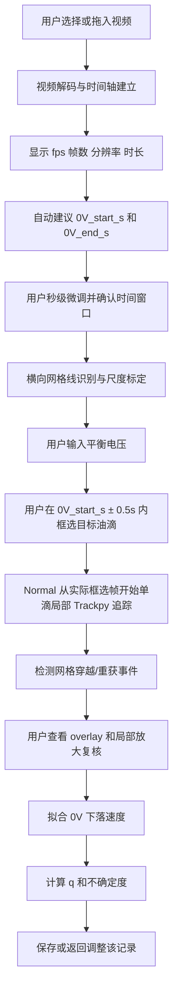

# Normal 视频处理与单颗油滴轨迹复核模块设计

> 适用阶段：Normal 主线第一版。
> 模块边界：负责导入视频、检查元数据、建议 `0 V` 下落起止时间、识别网格尺度、追踪用户框选的一颗油滴、生成跨网格复核事件和可视化轨迹。
> 不负责：Experimental 的全局候选、多滴自动排序、多电压平台自动分析，也不负责把未经用户复核的候选直接送入 q 或 e 结论。

> 当前产品原则：Normal 是人机协同测量流程。AI 负责建议、追踪、标风险和生成证据；用户负责确认 `0 V` 时间窗口、平衡电压、目标油滴、跨网格身份一致性，以及最终是否保留该 q 记录。

---

## 1. 当前版本目标

Normal 第一版不做全画面多油滴同时追踪，也不做自动最佳油滴选择作为主线。它采用：

```text
用户导入或拖入视频
→ 程序检查 fps、帧数、分辨率、时长
→ 程序建议 0V_start_s / 0V_end_s
→ 用户用秒级控件微调并确认
→ 用户输入平衡电压，并在确认的 0V_start_s 前后 0.5 s 内框选一颗油滴
→ 程序从实际框选帧开始只追踪这颗油滴
→ 程序标出跨网格/重获事件供用户复核
→ 用户确认后保存一条 q 测量记录
```

这样把 AI 放在“辅助测量和复核”的位置，避免把串滴、跨网格丢失或短视频边界误判包装成自动结论。

### 1.1 当前待验证方向：避开网格线的单段轨迹

老师建议的最新上游试验方向不是强行把油滴跨越网格线的全过程一次追到底，而是先把网格线邻域视为不可靠区域：

```text
候选油滴轨迹
→ 在接近网格线邻域时切断
→ 只保留未接触网格线的连续片段
→ 优先选择最长、运动最稳定的一段
→ 先验证该段的位置和速度是否可信
```

当前实现已经把该方向接入上游追踪：使用队友 Trackpy 单油滴局部追踪作为核心，多关键帧生成候选 seed，每个 seed 独立维护单滴状态，预测位置进入网格线邻域时切断当前可靠片段。当前仍不做网格两侧自动重连。

必须区分：

```text
一个连续轨迹片段 ≠ 一个完整 q ≠ 一个独立的 e 反演样本
```

单电压平台下的一段可靠轨迹只能估计一个终端速度。要计算同一颗油滴的 q，仍需要同一颗油滴在至少两个不同电压平台下的可靠速度。基本电荷盲反演则需要多颗独立油滴的 q_i，而不是很多轨迹片段。

Normal 模块最终输出：

```text
normal_session.json
records/<record_id>/track.csv
records/<record_id>/q_result.json
records/<record_id>/crossing_events.json
records/<record_id>/visualization_layers.json
records/<record_id>/overlay_review.mp4
```

其中最重要的是每条 `record` 的：

```text
q_C, sigma_q_C, radius_m, tracking provenance, 0V_start_s, 0V_end_s
```

Normal session 在每次应用启动时重新开始，不自动加载旧记录；一次启动内可以跨多个视频累积这些记录。至少三条被用户保留的有效 q 记录后，才进入 Normal 盲反演。长期保存只能通过用户显式导出。

Normal 阶段允许用户显式返回上一步。返回时恢复用户已经确认过的视频、
metadata、网格、`0 V` 边界、平衡电压、参数覆盖和框选信息；如果用户修改
`0 V` 边界，则当前 target/tracking/crossing/q candidate 必须清空或重新
生成。如果用户修改 target 时间或矩形框，则当前 tracking/crossing/q
candidate 必须清空或重新生成。旧 record 保留为不可隐式覆盖的证据。

---

## 2. 输入视频假设

用户上传的是拍摄实验装置显示屏的完整视频，而不是单独的显微图像。

视频中通常包含：

```text
1. 黑底白线网格显微区域
2. 多个亮点油滴
3. 右上角电压显示
4. 可能存在右上角计时显示
5. 屏幕边框、反光、倾斜、塑料膜反光等干扰
```

Normal 采用以下约定：

```text
1. 不在 Normal 主线启用电压 OCR
2. 平衡电压由用户输入
3. 程序自动建议 0 V 下落起止时间，但用户必须确认
4. UI 对用户只显示和编辑秒，帧号只作为内部和 artifact provenance
5. 油滴运动时间以视频帧时间戳或 frame_idx / fps 为准
6. 一次只追踪用户框选的一颗油滴
7. 第二根横向网格线到倒数第二根横向网格线之间是有效测量区域
8. 选滴时间窗口以用户确认的 0V_start_s 为中心，前后各 0.5 s
```

---

## 3. 推荐技术栈

当前桌面路线采用 Electron + React + Python worker。

```text
UI: Electron + React
视频处理: OpenCV
粒子检测参考: trackpy
数值计算: NumPy / SciPy / pandas
Worker 打包: PyInstaller onefile worker
桌面打包: electron-builder Windows portable
```

选择理由：

```text
1. develop 已有 Electron 桌面壳和 Python worker
2. OpenCV/Python 更适合本地视频处理和调试
3. trackpy 与油滴/粒子追踪场景接近
4. PyInstaller worker + Electron portable 可保持用户侧免 Python 安装
5. Normal 和 Experimental 可以在 renderer、IPC、worker op、backend module 上明确分路
```

---

## 4. 总体流程


```mermaid
flowchart TD
    A[用户选择或拖入视频] --> B[视频解码与时间轴建立]
    B --> C[显示 fps 帧数 分辨率 时长]
    C --> D[自动建议 0V_start_s 和 0V_end_s]
    D --> E[用户秒级微调并确认时间窗口]
    E --> F[横向网格线识别与尺度标定]
    F --> G[用户输入平衡电压]
    G --> H[用户在 0V_start_s ± 0.5s 内框选目标油滴]
    H --> I[Normal 从实际框选帧开始单滴局部 Trackpy 追踪]
    I --> J[检测网格穿越/重获事件]
    J --> K[用户查看 overlay 和局部放大复核]
    K --> L[拟合 0V 下落速度]
    L --> M[计算 q 和不确定度]
    M --> N[保存或返回调整该记录]
```

---

## 5. 视频解码与时间轴

### 5.1 时间来源

本模块明确不使用屏幕上的计时数字作为运动时间。

优先级：

```text
1. 视频帧真实时间戳 PTS
2. frame_idx / fps
3. 用户手动指定 fps
```

输出字段：

```text
frame_idx
time_s
```

其中：

```text
time_s = frame_idx / fps
```

或使用视频解码器读取到的真实时间戳。

### 5.2 注意 variable frame rate

手机视频可能存在可变帧率。若 OpenCV 读取的 fps 与真实时间戳不一致，后续速度会产生系统误差。

推荐实现：

```text
第一版：OpenCV 读取 fps，记录警告
增强版：使用 PyAV / ffmpeg 读取真实 PTS
```

---

## 6. 显示屏区域识别与透视矫正

用户上传的视频可能存在倾斜、透视变形、屏幕边框和反光。

处理目标：

```text
把原始视频帧变换为标准正视屏幕图像
```

自动流程：

```text
1. 选取若干关键帧
2. 检测显示屏边缘或最大高对比矩形
3. 估计四个角点
4. 计算 homography
5. 对所有帧做透视矫正
```

失败回退：

```text
让用户手动点击屏幕四个角点
```

输出：

```json
{
  "screen_corners": [[x1, y1], [x2, y2], [x3, y3], [x4, y4]],
  "homography": "3x3 matrix",
  "rectified_width": 1280,
  "rectified_height": 720
}
```

---

## 7. ROI 识别

矫正后图像分为两个核心区域：

```text
microscope_roi: 油滴运动与网格区域
voltage_roi: 右上角电压显示区域
```

第一版采用：

```text
自动检测 + 用户确认
```

如果自动识别错误，用户可以手动框选。手动结果保存到项目配置中，后续同类视频复用。

---

## 8. 网格线识别与尺度标定

### 8.1 网格线检测

在 microscope_roi 中检测水平白线。

步骤：

```text
1. 灰度化
2. 提高亮线对比度
3. 使用阈值分割提取白线
4. 使用 Hough line 或水平投影检测横向网格线
5. 合并重复线
6. 按 y 坐标排序
```

### 8.2 有效测量区间

按照实验约定：

```text
第二根白线 → 倒数第二根白线
```

对应物理距离：

```text
l = 1.5 mm
```

如果用户修改仪器参数，则使用用户输入的 l。

计算：

```text
scale_y_m_per_px = l_m / abs(y_end_px - y_start_px)
```

输出：

```json
{
  "grid_lines_y": [y1, y2, y3, ...],
  "y_start_px": "第二根白线 y 坐标",
  "y_end_px": "倒数第二根白线 y 坐标",
  "measurement_distance_m": 0.0015,
  "scale_y_m_per_px": "..."
}
```

### 8.3 用户确认

必须在 UI 中显示：

```text
1. 检测出的所有横向网格线
2. 有效测量起点线
3. 有效测量终点线
4. scale_y
```

用户确认后再进入追踪。

---

## 9. `0 V` 下落窗口建议与用户确认

Normal 不启用电压 OCR，也不自动读取右上角电压值。平衡电压由用户输入；程序只根据画面变化建议 `0 V` 下落窗口。

### 9.1 自动建议

程序在右上角电压显示区域或用户确认的显示区域计算视觉描述子变化，寻找明显的电压操作时刻。Normal 只需要两个用户可理解的时间：

```text
0V_start_s：切到 0 V 后，油滴进入下落测量的开始时间
0V_end_s：离开 0 V 或本次下落测量结束时间
```

如果检测到两次明显操作：

```text
第一次操作结束 + 稳定等待时间 → 0V_start_s
第二次操作开始之前 → 0V_end_s
```

如果只检测到一次操作，则 `0V_end_s` 可以暂取视频尾部附近，并打出 `zero_v_end_needs_review`。

### 9.2 用户秒级微调

UI 必须用秒显示时间，不让用户直接编辑帧号。推荐控件：

```text
0V_start_s: -1s -0.1s +0.1s +1s
0V_end_s:   -1s -0.1s +0.1s +1s
```

每次微调都应同步视频预览到对应时间，方便用户看清油滴是否已经进入稳定下落段。帧号只作为 artifact provenance 保存：

```json
{
  "zero_v_start_s": 1.8,
  "zero_v_end_s": 4.7,
  "zero_v_start_frame": 54,
  "zero_v_end_frame": 141,
  "source": "auto_suggested_user_confirmed"
}
```

用户确认边界后，选滴窗口固定为：

```text
selection_window_start_s = max(0, confirmed_0V_start_s - 0.5)
selection_window_end_s   = min(video_duration_s, confirmed_0V_start_s + 0.5)
```

该窗口必须以后端确认值为准。前端控件只能在这个范围内微调；后端
`selectTarget` 必须拒绝窗口外的 target frame。追踪起点必须等于用户实际
框选帧，不能把后面某一帧的坐标套用到更早的 `0V_start_s` 帧。

选滴阶段的预览就是主视频播放器本身：确认 0V 边界后，播放器暂停并跳到
后端确认的 `0V_start_s`，用户可在 `0V_start_s ± 0.5 s` 内用秒级控件微调。
微调后播放器显示的当前帧、UI 的 `selection_time_s`、提交给后端的
`target_frame` 必须指向同一帧。侧栏截图预览不能替代主视频帧预览。

用户返回修改 `0V` 时，必须恢复该次测量或 record 中保存的用户确认边界，
不能恢复最初自动建议值。若用户再次修改边界，旧的 `selection_window` 必须
作废并在确认后由后端按新边界重算。若请求中同时带有秒数和旧帧号，
`normal.confirmBoundary` 以用户编辑的秒数为准，重新计算帧号。

### 9.3 失败回退

如果视觉变化不足以建议窗口，Normal 不应静默进入 q 计算。UI 应提示用户手动拖动视频到 `0 V` 下落开始和结束位置，并把来源记录为：

```text
source=manual_time_window
```

---

## 10. 阈值 x 的定义与默认策略

之前讨论的阈值 x 不应理解为“整个平台时长必须大于 x”这么粗糙，而应定义为：

> 每个电压平台内，可用于速度拟合的稳定运动片段的最短持续时间。

记为：

```text
x_stable
```

### 10.1 为什么需要 x

每个平台内的速度拟合需要足够多的帧，否则：

```text
1. 线性拟合不稳定
2. 布朗运动影响过大
3. 油滴定位噪声被放大
4. 电压刚切换后的加速过渡段可能混入
```

### 10.2 推荐默认值

第一版默认：

```text
x_stable = max(2.0 s, 60 / fps)
```

对于 30 fps 视频：

```text
x_stable = 2.0 s
```

即每个平台至少需要约 60 帧稳定轨迹。

同时定义：

```text
x_transient = 0.5 s
```

表示电压切换后默认丢弃前 0.5 秒作为过渡段。

所以一个平台若要可用，粗略要求：

```text
platform_duration >= x_transient + x_stable
```

即默认：

```text
platform_duration >= 2.5 s
```

### 10.3 自适应修正

固定 2 秒不是绝对规则，程序应结合实际帧数和拟合质量自适应判断。

平台稳定段还需满足：

```text
num_valid_points >= 45
missing_ratio <= 0.15
speed_fit_r2 >= 0.95
speed_fit_rmse <= rmse_threshold
```

对于接近平衡的电压平台，油滴位移很小，不能强行要求大位移，但要提高位置稳定性要求：

```text
|v_y| 接近 0
position_rmse 小
持续时间 >= x_stable
```

对于明显运动的平台，除时间要求外还要求：

```text
vertical_displacement_px >= max(15 px, 0.25 * grid_spacing_px)
```

否则速度估计会不稳定。

### 10.4 x 的配置项

建议在配置文件中暴露：

```yaml
segment:
  boundary_guard_frames: 0
  stable_min_duration_s: 2.0
  min_valid_points: 45
  max_missing_ratio: 0.15
  min_fit_r2: 0.95
  min_motion_displacement_px: 15
  min_motion_displacement_grid_ratio: 0.25
```

用户界面中可以显示为：

```text
稳定运动片段最短时长 x = 2.0 s
电压切换过渡丢弃时间 = 0.5 s
```

---

## 11. 油滴候选检测

### 11.1 检测目标

在显微 ROI 中找出可能是油滴的小亮点。

每个候选点输出：

```text
frame_idx
time_s
x_px
y_px
radius_px
area_px
brightness
contrast
candidate_score
```

### 11.2 预处理

```text
1. 灰度化
2. 去噪
3. 背景估计
4. 网格线 mask
5. 局部对比度增强
```

### 11.3 网格线抑制

示例视频中，网格线比油滴更亮，是主要误检来源。

处理策略：

```text
1. 使用网格线检测结果生成 grid_mask
2. 对网格线附近区域降低候选置信度
3. 排除长条状、线状、高宽比异常区域
4. 对网格交点进行额外惩罚
```

油滴候选应满足：

```text
1. 面积较小
2. 形状近似圆形
3. 局部亮度高于背景
4. 不属于长线段
5. 在连续帧中具有时间一致性
```

---

## 12. 生成候选油滴种子（Experimental / 未来辅助）

本节描述的是 Experimental 或未来“推荐用户框选位置”的辅助能力，不是
Normal v1 的主线。Normal v1 由用户矩形框选目标油滴，只追踪这一个目标。

推荐策略：

```text
1. 在每个电压平台中抽取若干关键帧
2. 对关键帧进行油滴候选检测
3. 过滤明显噪声和网格点
4. 选出若干候选种子点
5. 对每个种子执行单目标追踪
6. 最后根据轨迹质量推荐候选位置给用户复核
```

候选种子需要覆盖不同区域，避免都集中在一小块画面。

种子筛选条件：

```text
1. 不靠近边缘
2. 不贴近网格交点
3. 局部附近没有过多其他亮点
4. 在相邻帧中可被重复检测到
5. 初始亮度和圆度稳定
```

若在 Experimental 中启用，建议最多追踪：

```text
top_k_seeds = 20 ~ 50
```

---

## 13. 单目标追踪算法

### 13.1 为什么选择单目标追踪

当前版本目标是找出最优一颗油滴，而不是同时追踪所有油滴。

Experimental 可以继续保留候选种子路线；Normal 主线不自动生成全局候选
并选择最佳油滴。Normal 只对用户矩形框选的单颗目标执行一次
single-target tracking：

```text
user_selected_box → single_normal_track
```

这样避免了完整多目标追踪中的：

```text
1. ID switch
2. 多油滴遮挡匹配
3. Hungarian 全局分配
4. 轨迹合并/分裂复杂逻辑
```

### 13.2 单目标追踪流程

每个候选油滴维护一个状态：

```text
x, y, vx, vy
```

逐帧处理：

```text
1. 使用上一检测位置和速度外推当前帧预测位置
2. 在预测位置附近建立 local search window
3. 在窗口内调用 Trackpy `locate` 检测候选油滴
4. 从候选中选择距离预测位置最近且不超过接受距离的目标
5. 若预测位置进入网格 mask 邻域，则跳过检测并标记 `blocked_by_grid`
6. 若观测可信，则更新当前位置、速度和 Trackpy mass 诊断
7. 若观测不可信，则记录预测点、`missed_count` 和 missing 状态
8. 遇到网格邻域、连续 missing 超限、离开 ROI、明显跳变或视频结束时结束当前 segment
```

Normal v1 的追踪参数必须与队友本地程序保持一致：

```text
diameter=5
minmass=80
local_search_radius=45
max_accept_distance=30
single_memory=5
local_topn=20
grid_reject_dilate_px=0
grid_occlusion_radius=0
skip_detection_on_grid=true
grid_mask_for_tracking_enabled=true
grid_removal_enabled=false
```

这些逻辑必须复制或重写到 `millikan_ai.normal` 内部；不能直接 import
`C:\Users\Teddy\Desktop\追踪`。允许做的改动只限于项目内 import、worker
进度事件和 artifact 序列化。

融合规则：

```text
如果 detection 与 LK 结果距离很近：采用加权平均
如果 detection 可信、LK 失败：采用 detection
如果 LK 可信、detection 失败：采用 LK
如果二者冲突严重：标记为 uncertain，不强行更新
```

### 13.3 复核 overlay

追踪结束后必须生成可播放 overlay，坐标来源只能是后端真实 track
CSV/record。overlay 样式与队友程序保持一致：

```text
detected/target：绿色圆圈 + "target"
missing/prediction：黄色圆圈 + "missing"
history trajectory：蓝色轨迹线
```

前端可以展示这个视频、时间、统计和 crossing 列表，但不得自行编造
target/missing 坐标或重画一套与 backend track 不一致的轨迹。

---

## 14. 轨迹按电压平台分段

一条候选轨迹得到后，按 platforms.csv 切分：

```text
candidate_track_001 / P001
candidate_track_001 / P002
candidate_track_001 / P003
```

每个平台片段先剔除过渡段：

```text
stable_start_time = platform_start_time + x_transient
```

然后取：

```text
[stable_start_time, platform_end_time]
```

如果该稳定片段持续时间小于 `x_stable`，则该平台对该轨迹不可用。

---

## 15. 稳定段速度拟合

对每个候选轨迹在每个平台内的稳定片段拟合：

```text
y(t) = v_y t + b
x(t) = v_x t + c
```

输出：

```text
v_y_px_s
v_y_m_s
sigma_v_y
v_x_px_s
r2_y
rmse_y
num_points
missing_ratio
stable
```

其中：

```text
v_y_m_s = v_y_px_s * scale_y_m_per_px
```

判断稳定的基本条件：

```text
num_points >= min_valid_points
segment_duration >= x_stable
missing_ratio <= max_missing_ratio
r2_y >= min_fit_r2
```

对于近似悬浮平台：

```text
r2_y 可能不高，因为 y 变化极小
```

此时应改用稳定性判断：

```text
abs(v_y_m_s) < balance_velocity_threshold
position_rmse_px < balance_position_rmse_threshold
segment_duration >= x_stable
```

---

## 16. 候选轨迹质量评分

每条候选轨迹计算综合质量分：

```text
score_total =
    0.25 * platform_coverage_score
  + 0.20 * tracking_continuity_score
  + 0.20 * velocity_fit_score
  + 0.15 * morphology_stability_score
  + 0.10 * grid_distance_score
  + 0.10 * voltage_confidence_score
```

### 16.1 platform_coverage_score

核心指标。

```text
至少两个不同电压平台有可用稳定段 → 才能进入候选
三个及以上平台 → 加分
```

定义：

```text
usable_platform_count < 2 → reject
usable_platform_count = 2 → 0.7
usable_platform_count >= 3 → 1.0
```

### 16.2 tracking_continuity_score

考虑：

```text
轨迹总时长
missing_ratio
valid_detection_ratio
连续 missing 最大长度
是否跨平台断裂
```

### 16.3 velocity_fit_score

考虑：

```text
各平台稳定段 R²
RMSE
速度滑动窗口稳定性
是否存在明显加速度
```

### 16.4 morphology_stability_score

考虑：

```text
radius_cv
area_cv
brightness_cv
局部对比度稳定性
```

### 16.5 grid_distance_score

油滴若长期贴近网格线或网格交点，容易误检。

```text
距离网格线越远，得分越高
```

但不能简单剔除靠近网格线的所有点，因为真实油滴也可能经过网格线。应作为惩罚，不作为硬删除。

### 16.6 voltage_confidence_score

本项只属于 Experimental 或未来自动候选辅助功能，不属于 Normal 主线。

Normal 中平衡电压由用户输入，`0 V` 下落窗口由用户确认。Normal 记录应保存时间窗口来源和用户确认状态，而不是保存 OCR 置信度。

---

## 17. 目标油滴确认规则

Normal 不自动选择“最佳油滴”作为主线。目标油滴由用户在视频帧上框选，程序只负责追踪该目标并报告风险。

用户框选后，追踪结果需要先过硬规则：

```text
1. 0V 下落窗口内有效检测点数足够
2. 下落持续时间达到最小要求
3. y(t) 线性拟合质量满足阈值，或给出明确低质量 flag
4. missing_ratio 不超过阈值
5. 横向漂移不过大
6. 跨网格/重获事件已生成并等待用户复核
```

程序可以给出诊断评分，但评分不能替代用户确认。用户可以：

```text
1. 保留为有效 q 记录
2. 保存为诊断记录
3. 调整时间窗口或重新框选
4. 放弃该油滴，测量另一颗
```

如果要在未来加入自动候选推荐，它只能作为“推荐用户点击这里”的辅助层，不能直接绕过框选和复核进入 q/e 结论。

旧 Experimental 最佳候选路线可保留为独立模式：

```text
全局候选油滴发现
→ 多个候选单目标追踪
→ 对每条候选轨迹评分
→ 自动推荐候选
```

---

## 18. 输出文件设计

### 18.1 platforms.csv

```csv
platform_id,start_frame,end_frame,start_time_s,end_time_s,voltage_V,voltage_confidence,source
```

### 18.2 best_track.csv

逐帧轨迹：

```csv
video_id,track_id,frame_idx,time_s,x_px,y_px,radius_px,area_px,brightness,voltage_V,platform_id,is_valid_detection,tracking_source
```

其中 `tracking_source` 可取：

```text
trackpy_seed
trackpy_detection
trackpy_prediction
manual_corrected
```

Trackpy 接入后可追加诊断列：

```csv
segment_id,pred_x_px,pred_y_px,blocked_by_grid,missed_count,mass,end_reason
```

### 18.3 best_track_segments.csv

平台级速度摘要：

```csv
video_id,track_id,platform_id,voltage_V,start_time_s,end_time_s,num_points,duration_s,vy_px_s,vy_m_s,sigma_vy,vx_px_s,r2_y,rmse_y,stable,flags
```

这是后续物理计算模块的主输入。

### 18.4 candidate_tracks_summary.csv

所有候选轨迹摘要：

```csv
candidate_id,usable_platform_count,total_duration_s,missing_ratio,score_total,rank,reject_reason
```

用于调试和复核。

Trackpy 多滴分段实现可追加：

```csv
num_points,duration_s,blocked_by_grid_count,max_step_px,step_p95_px,path_efficiency,vy_px_s,vx_px_s,r2_y,rmse_y,mass_cv,end_reason,duplicate_of,selected_for_multi_drop
```

### 18.5 diagnostics.json

保存全部关键配置和诊断结果：

```json
{
  "video": {
    "fps": 30,
    "frame_count": 570,
    "duration_s": 19.0
  },
  "thresholds": {
    "x_stable_s": 2.0,
    "x_transient_s": 0.5,
    "min_valid_points": 45
  },
  "grid": {
    "scale_y_m_per_px": "..."
  },
  "best_track": {
    "track_id": "best_001",
    "score_total": 0.87,
    "usable_platform_count": 3
  }
}
```

### 18.6 overlay_best_track.mp4

用于人工复核。

主追踪 overlay 视频应按队友程序样式显示：

```text
1. 真实检测目标：绿色圆圈 + target
2. 预测或丢失位置：黄色圆圈 + missing
3. 已形成轨迹：蓝色线
```

`0 V` 下落窗口、有效测量区、grid lines、速度拟合区间和 crossing
标记可以在前端复核界面作为独立结构化图层或旁侧信息展示，但不能改变主
overlay 中 target/missing/trajectory 的坐标来源和样式。

---

## 19. UI 交互流程

Normal 第一版推荐 UI 流程：

```text
1. 用户通过文件选择或拖拽导入视频
2. 程序读取并显示 fps、帧数、分辨率、时长
3. 程序自动建议 0V_start_s 和 0V_end_s
4. 用户用秒级控件粗调/细调并确认 0V 下落窗口
5. 程序识别横向网格线，标出第二根到倒数第二根有效区
6. 用户输入平衡电压
7. 用户在 0V 前后可预览画面中框选一颗油滴
8. 程序运行 Normal 单滴局部 Trackpy 追踪
9. UI 播放按队友样式生成的追踪 overlay，并在旁侧显示网格、0V 窗口和拟合区间信息
10. 对每个 crossing event，用户点击查看局部放大复核片段
11. 程序计算 q 和不确定度
12. 用户选择保留、返回调整、保存诊断或放弃
13. Normal session 在本次启动内跨视频累积 q 记录；重启后从全新测量开始
14. 至少三条用户确认保留的有效 q 后，运行 Normal 盲反演并展示量子化对齐残差诊断；在没有真实连续模型前不展示模型胜负
```

这个流程刻意不是完全无人参与。交互点集中在真实实验中最容易出错的环节：时间窗口、目标油滴、跨网格身份一致性和是否保留 q。

---

## 20. 模块目录建议

```text
src/millikan_ai/normal/
├── video.py              # video metadata, frame reads, file identity
├── voltage.py            # 0V window suggestion, not OCR
├── grid.py               # horizontal grid detection and scale
├── tracking.py           # copied/reimplemented local Trackpy single-drop tracker
├── physics.py            # balance-voltage + 0V q and uncertainty
├── inversion.py          # Normal-only weighted integer residual grid search
├── session.py            # transient per-launch q records and explicit export
└── schemas.py            # Normal session/record contracts

apps/desktop/src/components/normal/
├── NormalWorkspace.tsx
├── NormalVideoPlayer.tsx
├── BoundaryEditor.tsx
├── TargetSelector.tsx
├── CrossingReview.tsx
├── QRecordManager.tsx
└── NormalResults.tsx
```

---

## 21. 第一版验收标准

### 21.1 功能验收

```text
1. 能读取用户上传或拖入的视频
2. 能显示 metadata 并在用户点击开始处理后建议 `0V_start_s` / `0V_end_s`
3. 能让用户用秒级控件确认 `0 V` 边界并随时返回修改
4. 能把选滴时间限制到用户确认的 `0V_start_s ± 0.5 s`
5. 能让用户用矩形框选一颗油滴，并正确处理视频缩放和黑边坐标映射
6. 能从实际框选帧开始追踪这一颗油滴
7. 能输出 track.csv、q_result.json、crossing_events.json 和 overlay_review.mp4
8. 能在 crossing 未复核或被判定不同油滴时阻断该记录进入确认和反演
9. 能在用户确认后才把 q 记录标记为 accepted
```

### 21.2 数据质量验收

用户框选并确认保留的 Normal 记录应满足：

```text
1. `0 V` 下落段有效拟合点数满足阈值
2. 下落持续时间满足阈值
3. 轨迹 missing_ratio 不超过阈值
4. 速度线性拟合给出有限正 `sigma_v`
5. `sigma_q_C` 由速度斜率不确定度传播得到，不使用经验 5% floor
6. crossing event 已全部人工复核为同一颗油滴，或该记录明确为 diagnostic/blocked
7. overlay 视频中 target/missing/轨迹可肉眼复核
```

### 21.3 工程验收

```text
1. 所有输出文件 schema 固定
2. 所有阈值写入 config，不硬编码在算法里
3. 用户手动修正的信息可保存并复用
4. 失败时必须给出原因，而不是静默输出错误结果
```

---

## 22. 本模块最终对外表述

Normal 视频处理模块不追求全画面多油滴同时追踪，也不把“自动选择最佳油滴”作为主线。系统从真实实验视频中自动建议 `0 V` 下落窗口、识别网格尺度、追踪用户框选的一颗油滴，并把跨网格/重获等高风险位置做成可点击复核事件。用户确认后，系统计算该滴的 $q_i \pm \sigma_{q_i}$ 并保存为本次启动的 transient Normal session 记录。

这种设计把 AI 的能力放在可解释辅助上：自动发现候选时间、自动追踪、自动标出风险、自动计算不确定度和盲反演；但不替代实验者对关键物理证据的确认。本次启动内跨多个视频累积至少三条有效 q 后，Normal 再展示基本电荷盲反演和量子化对齐残差诊断；在没有定义并拟合真实连续 baseline 前，不宣称量子化模型优于连续模型。
